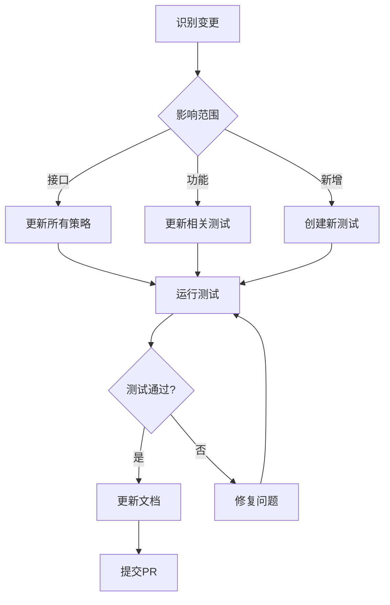
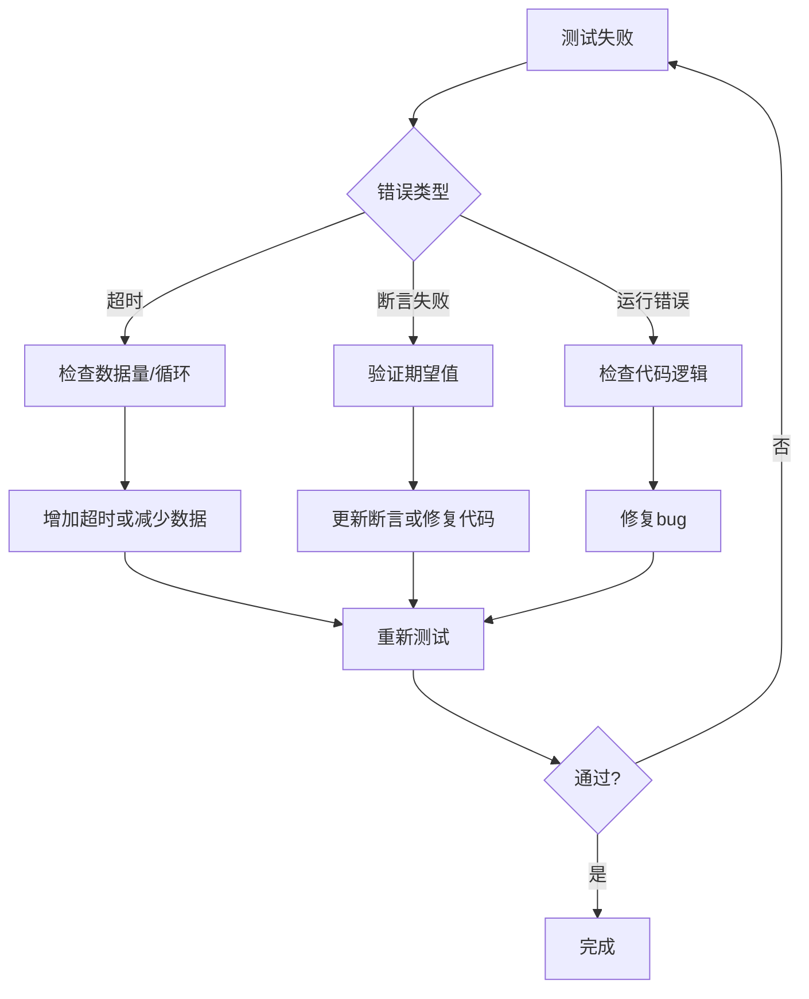

# E2E 测试维护指南

**版本**: 1.0  
**最后更新**: 2024-11-08  
**维护者**: AI Assistant

---

## 📋 目录

1. [维护职责](#维护职责)
2. [日常维护](#日常维护)
3. [更新测试](#更新测试)
4. [CI集成](#ci集成)
5. [性能监控](#性能监控)
6. [故障排查](#故障排查)
7. [最佳实践](#最佳实践)

---

## 维护职责

### 测试维护者

**职责**:
- ✅ 确保测试始终通过
- ✅ 更新测试以反映系统变化
- ✅ 修复失败的测试
- ✅ 添加新的测试场景
- ✅ 优化测试性能
- ✅ 维护文档

### 团队成员

**职责**:
- ✅ 在修改代码前运行测试
- ✅ 修复因自己代码导致的测试失败
- ✅ 为新功能添加测试
- ✅ 报告测试问题

---

## 日常维护

### 每日检查清单

- [ ] 运行完整测试套件
- [ ] 检查测试运行时间
- [ ] 查看测试覆盖率
- [ ] 检查CI状态
- [ ] 处理失败的测试

**命令**:
```bash
# 运行所有测试
npm run test:e2e

# 查看覆盖率
npm run test:coverage

# CI状态
npm run ci:status
```

### 每周检查清单

- [ ] 审查测试性能趋势
- [ ] 更新测试数据
- [ ] 清理过期测试
- [ ] 更新文档
- [ ] 代码审查测试PR

### 每月检查清单

- [ ] 全面审查测试套件
- [ ] 评估测试价值
- [ ] 重构重复测试
- [ ] 更新最佳实践
- [ ] 团队培训

---

## 更新测试

### 何时更新测试

#### 1. 接口变更

**场景**: 修改了`TestStrategy`接口

**步骤**:
1. 更新所有测试策略实现
2. 更新类型定义
3. 运行测试验证
4. 更新文档

**示例**:
```typescript
// 旧接口
interface TestStrategy {
  run(): Promise<TestResult>;
}

// 新接口
interface TestStrategy {
  run(): Promise<TestResult>;
  cleanup?(): Promise<void>; // 新增
}

// 更新所有策略
export class PriceEchoStrategy implements TestStrategy {
  async run() { ... }
  
  // 新增清理方法
  async cleanup() {
    this.logs = [];
    this.trades = [];
  }
}
```

#### 2. 功能变更

**场景**: 修改了订单撮合逻辑

**步骤**:
1. 识别受影响的测试
2. 更新测试期望值
3. 添加新的测试场景
4. 运行回归测试

**示例**:
```typescript
// 旧期望：40笔交易
assert.assertEqual(trades.length, 40);

// 新期望：撮合逻辑变化，现在35笔
assert.assertEqual(trades.length, 35);
```

#### 3. 新增功能

**场景**: 添加了新的风控规则

**步骤**:
1. 编写新的测试策略
2. 添加断言验证
3. 集成到测试套件
4. 更新文档

**示例**:
```typescript
// 新增测试
export class NewRiskRuleTest implements TestStrategy {
  name = 'NewRiskRule';
  
  async run() {
    // 测试新规则
  }
  
  async assert(results) {
    // 验证新规则生效
  }
}

// 注册到套件
runner.register(new NewRiskRuleTest());
```

###  更新流程



---

## CI集成

### GitHub Actions配置

```yaml
# .github/workflows/e2e-tests.yml
name: E2E Tests

on:
  pull_request:
    branches: [ main, develop ]
  push:
    branches: [ main ]
  schedule:
    - cron: '0 2 * * *'  # 每天凌晨2点

jobs:
  e2e-tests:
    runs-on: ubuntu-latest
    
    steps:
      - uses: actions/checkout@v3
      
      - name: Setup Node.js
        uses: actions/setup-node@v3
        with:
          node-version: '18'
          
      - name: Install dependencies
        run: npm ci
        
      - name: Run E2E Tests
        run: npm run test:e2e
        
      - name: Upload test results
        if: always()
        uses: actions/upload-artifact@v3
        with:
          name: e2e-test-results
          path: test-results/
```

### 失败通知

```yaml
      - name: Notify on failure
        if: failure()
        uses: 8398a7/action-slack@v3
        with:
          status: ${{ job.status }}
          text: 'E2E tests failed!'
          webhook_url: ${{ secrets.SLACK_WEBHOOK }}
```

### 性能报告

```yaml
      - name: Generate performance report
        run: npm run test:perf-report
        
      - name: Comment PR
        uses: actions/github-script@v6
        with:
          script: |
            const fs = require('fs');
            const report = fs.readFileSync('perf-report.md', 'utf8');
            github.rest.issues.createComment({
              issue_number: context.issue.number,
              owner: context.repo.owner,
              repo: context.repo.name,
              body: report
            });
```

---

## 性能监控

### 性能基准

| 测试策略 | 目标时间 | 警告阈值 | 失败阈值 |
|---------|---------|---------|---------|
| PriceEcho | < 5s | 10s | 15s |
| FixedRebalance | < 10s | 20s | 30s |
| RiskStress | < 8s | 16s | 24s |
| SnapshotResume | < 12s | 24s | 36s |
| EdgeCases | < 6s | 12s | 18s |

### 监控命令

```bash
# 运行性能测试
npm run test:perf

# 生成性能报告
npm run test:perf-report

# 对比历史性能
npm run test:perf-compare
```

### 性能优化建议

#### 1. 减少数据量

✅ **优化前**:
```typescript
const testData = DataGenerator.generateUptrend(10); // 10天
```

✅ **优化后**:
```typescript
const testData = DataGenerator.generateUptrend(2); // 2天足够
```

#### 2. 并行测试

✅ **优化前**:
```typescript
for (const test of tests) {
  await runner.run(test);
}
```

✅ **优化后**:
```typescript
await runner.runAll(); // 自动并行
```

#### 3. 缓存数据

✅ **优化**:
```typescript
// 共享测试数据
const sharedData = DataGenerator.generateUptrend(2);

test1.useData(sharedData);
test2.useData(sharedData);
```

---

## 故障排查

### 常见问题处理流程



### 问题1: 测试间歇性失败

**症状**: 测试有时通过，有时失败

**可能原因**:
- 时序问题
- 随机数据
- 共享状态

**解决方案**:
```typescript
// 1. 使用固定种子
Math.seedrandom('fixed-seed');

// 2. 增加等待时间
await new Promise(resolve => setTimeout(resolve, 100));

// 3. 清理共享状态
beforeEach(() => {
  this.resetState();
});
```

### 问题2: 测试越来越慢

**症状**: 测试运行时间逐渐增长

**可能原因**:
- 内存泄漏
- 累积数据
- 未清理资源

**解决方案**:
```typescript
// 1. 显式清理
afterEach(() => {
  this.trades = [];
  this.logs = [];
});

// 2. 检查订阅
eventBus.subscriptions.forEach(sub => sub.unsubscribe());

// 3. 监控内存
console.log('Memory usage:', process.memoryUsage());
```

### 问题3: CI通过但本地失败

**症状**: CI环境测试通过，本地失败

**可能原因**:
- 环境差异
- 依赖版本
- 文件权限

**解决方案**:
```bash
# 1. 检查Node版本
node --version

# 2. 清理依赖重装
rm -rf node_modules package-lock.json
npm install

# 3. 使用Docker
docker run -it --rm -v $(pwd):/app node:18 npm test
```

---

## 最佳实践

### 1. 测试隔离

✅ **好**:
```typescript
describe('PriceEcho', () => {
  let test: PriceEchoStrategy;
  
  beforeEach(() => {
    test = new PriceEchoStrategy();
  });
  
  afterEach(() => {
    test.cleanup();
  });
  
  it('should validate data', async () => {
    await test.run();
  });
});
```

❌ **差**:
```typescript
// 全局变量，测试间相互影响
let sharedTest = new PriceEchoStrategy();
```

### 2. 有意义的错误消息

✅ **好**:
```typescript
assert.assertEqual(
  trades.length,
  40,
  `Expected 40 trades for 4 days with 10 trades/day, but got ${trades.length}`
);
```

❌ **差**:
```typescript
assert.assertEqual(trades.length, 40); // 错误消息不明确
```

### 3. 测试文档化

✅ **好**:
```typescript
/**
 * 测试快照恢复功能
 * 
 * 场景：
 * 1. 运行720个bar
 * 2. 创建快照
 * 3. 模拟重启
 * 4. 恢复并继续运行
 * 
 * 验证：
 * - 快照创建成功
 * - 状态恢复一致
 * - 无重复交易
 */
it('should restore from snapshot', async () => {
  // ...
});
```

### 4. 定期审查

- 每月审查测试套件
- 删除过时测试
- 重构重复代码
- 更新文档

### 5. 版本控制

```bash
# 测试结果版本化
git tag e2e-baseline-v1.0
git push origin e2e-baseline-v1.0

# 性能基准版本化
npm run test:perf > baseline-v1.0.json
git add baseline-v1.0.json
git commit -m "chore: add performance baseline v1.0"
```

---

## 紧急响应

### 生产问题

**流程**:
1. 🚨 停止部署
2. 🔍 运行相关E2E测试
3. 🐛 重现问题
4. 🔧 修复并验证
5. ✅ 添加回归测试
6. 🚀 重新部署

**模板**:
```typescript
// 紧急回归测试
describe('Production Issue #123', () => {
  it('should handle edge case X', async () => {
    // 重现问题
    const test = createEdgeCasesTest({
      testCases: ['specific_case'],
    });
    
    const result = await test.run();
    
    // 验证修复
    expect(result.passed).toBe(true);
  });
});
```

---

## 工具和脚本

### 有用的脚本

```bash
# 快速运行单个测试
npm run test:e2e:single -- PriceEcho

# 生成测试报告
npm run test:report

# 清理测试数据
npm run test:clean

# 检查测试覆盖
npm run test:coverage

# 更新快照
npm run test:update-snapshots
```

### package.json配置

```json
{
  "scripts": {
    "test:e2e": "ts-node src/backtesting/e2e-tests/run-all-tests.ts",
    "test:e2e:basic": "ts-node src/backtesting/e2e-tests/run-basic-tests.ts",
    "test:e2e:advanced": "ts-node src/backtesting/e2e-tests/run-advanced-tests.ts",
    "test:e2e:watch": "nodemon --exec ts-node src/backtesting/e2e-tests/run-all-tests.ts",
    "test:perf": "ts-node src/backtesting/e2e-tests/performance-test.ts",
    "test:report": "ts-node src/backtesting/e2e-tests/generate-report.ts",
    "test:clean": "rm -rf test-results/ test-data/",
    "test:coverage": "jest --coverage --testPathPattern=e2e-tests"
  }
}
```

---

## 联系和支持

### 获取帮助

- 📖 [E2E测试指南](./E2E_TEST_GUIDE.md)
- 📖 [README](./README.md)
- 🐛 [报告问题](https://github.com/your-repo/issues)
- 💬 [Slack频道](#testing)
- 📧 [邮件列表](testing@example.com)

### 贡献

欢迎贡献！请参考 [CONTRIBUTING.md](../CONTRIBUTING.md)

---

**文档版本**: 1.0  
**最后更新**: 2024-11-08  
**维护者**: AI Assistant

