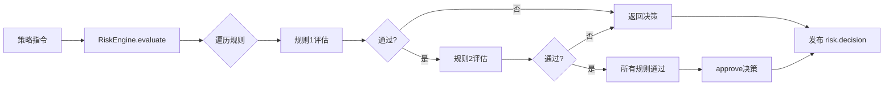

# RiskEngine - 风险控制引擎

**版本**: 1.0.0  
**状态**: ✅ 已完成  
**测试**: 13/13 通过 (100%)

---

## 📋 模块概述

RiskEngine 是一个可插拔的风险控制引擎，用于在回测系统中拦截策略的交易指令，评估是否符合预设的风控规则，并输出相应的决策（批准、拒绝、修改、暂停）。

### 核心特性

- ✅ **可插拔规则框架** - 支持动态注册和管理风控规则
- ✅ **内置规则集** - 提供 MaxOrderSize、MaxLeverage、PnLDailyLimit、StopLoss 等常用规则
- ✅ **规则优先级** - 支持按优先级顺序评估规则
- ✅ **状态管理** - 维护组合、仓位、历史统计等实时状态
- ✅ **决策输出** - 生成详细的风控决策和后续动作
- ✅ **快照恢复** - 支持风控状态的持久化和恢复
- ✅ **事件编排** - 自动订阅事件并发布决策

---

## 🏗️ 架构设计

### 核心组件

```
┌─────────────────────────────────────────────────────────────┐
│                    RiskEngine                               │
│  ┌───────────────────┐   ┌───────────────────┐            │
│  │  RiskEngine       │   │  RiskState        │            │
│  │  - evaluate()     │───│  - portfolio      │            │
│  │  - registerRule() │   │  - stats          │            │
│  │  - snapshot()     │   │  - activeRules    │            │
│  └───────────────────┘   └───────────────────┘            │
│           │                                                 │
│           ├─── MaxOrderSizeRule                           │
│           ├─── MaxLeverageRule                            │
│           ├─── PnLDailyLimitRule                          │
│           └─── StopLossRule                               │
│                                                            │
│  ┌─────────────────────────────────────────┐             │
│  │  RiskEngineOrchestrator                 │             │
│  │  - 订阅 strategy.intent                  │             │
│  │  - 订阅 portfolio.update                 │             │
│  │  - 订阅 execution.report                 │             │
│  │  - 发布 risk.decision                    │             │
│  └─────────────────────────────────────────┘             │
└─────────────────────────────────────────────────────────────┘
```

### 决策流程



---

## 🚀 快速开始

### 1. 基本使用

```typescript
import { 
  createRiskEngine, 
  MaxOrderSizeRule, 
  MaxLeverageRule 
} from '@/backtesting/risk';

// 创建风控引擎
const riskEngine = createRiskEngine({
  sessionId: 'session-001',
  strategyId: 'strategy-001',
  simulationMode: true,
});

// 注册规则
riskEngine.registerRule(
  new MaxOrderSizeRule({ 
    maxQuantity: '10',
    maxNotional: '10000',
  })
);

riskEngine.registerRule(
  new MaxLeverageRule({ 
    maxLeverage: 3,
  })
);

// 评估订单指令
const intent = {
  intentId: 'intent-001',
  strategyId: 'strategy-001',
  symbol: 'BTC/USDT',
  side: 'buy',
  quantity: '1.0',
  price: '50000',
  orderType: 'limit',
};

const result = await riskEngine.evaluate(intent);

console.log(result.decision); // 'approve' | 'reject' | 'modify' | 'halt'
console.log(result.reason);   // 原因信息
```

### 2. 使用编排器

```typescript
import { 
  createRiskEngine, 
  createRiskOrchestrator,
  MaxOrderSizeRule 
} from '@/backtesting/risk';
import { eventBus } from '@/backtesting/events';

// 创建引擎和编排器
const riskEngine = createRiskEngine({
  sessionId: 'session-001',
  strategyId: 'strategy-001',
});

const orchestrator = createRiskOrchestrator('session-001');

// 注册规则
riskEngine.registerRule(new MaxOrderSizeRule({ maxQuantity: '10' }));

// 启动编排器（自动订阅事件）
orchestrator.start(eventBus, riskEngine);

// 发布策略指令（编排器会自动处理）
eventBus.publish({
  eventType: 'strategy.intent',
  payload: {
    intentId: 'intent-001',
    strategyId: 'strategy-001',
    symbol: 'BTC/USDT',
    side: 'buy',
    quantity: '1.0',
    price: '50000',
    orderType: 'limit',
  },
});

// 停止编排器
orchestrator.stop();
```

---

## 📚 内置规则

### 1. MaxOrderSizeRule - 最大订单规模

限制单笔订单的数量或名义价值。

```typescript
new MaxOrderSizeRule({
  maxQuantity: '10',      // 最大数量
  maxNotional: '10000',   // 最大名义价值
  symbols: ['BTC/USDT'],  // 监控的交易对（可选）
  priority: 10,           // 优先级（可选）
});
```

**决策**:
- 超过 `maxQuantity`: `reject`
- 超过 `maxNotional`: `modify`（自动调整数量）

---

### 2. MaxLeverageRule - 最大杠杆率

限制账户总杠杆率和敞口。

```typescript
new MaxLeverageRule({
  maxLeverage: 3,             // 最大杠杆率（如 3x）
  maxExposurePerSymbol: '50000',  // 单个标的最大敞口（可选）
  maxExposureTotal: '100000',     // 总最大敞口（可选）
  priority: 20,
});
```

**决策**:
- 超过任一限制: `reject`

---

### 3. PnLDailyLimitRule - 日内盈亏限制

限制日内最大亏损和盈利锁定。

```typescript
new PnLDailyLimitRule({
  dailyLossLimit: '-1000',    // 日内最大亏损（负数）
  dailyProfitLock: '2000',    // 日内盈利锁定（可选）
  resetAt: '00:00:00Z',       // 重置时间（可选）
  priority: 30,
});
```

**决策**:
- 达到 `dailyLossLimit`: `halt`（暂停策略）
- 达到 `dailyProfitLock`: `reject`（拒绝新订单）

---

### 4. StopLossRule - 止损规则

基于最大回撤触发止损。

```typescript
new StopLossRule({
  maxDrawdownPct: 0.1,    // 最大回撤百分比（如 0.1 = 10%）
  forceClose: true,       // 是否强制平仓
  graceBars: 3,           // 宽限期（bar数，可选）
  priority: 40,
});
```

**决策**:
- 超过回撤且 `forceClose=false`: `reject`
- 超过回撤且 `forceClose=true`: `halt`（并发布 `force-close` 动作）

---

## 🔧 自定义规则

### 实现 RiskRule 接口

```typescript
import Big from 'big.js';
import { RiskRule, RiskRuleContext, RiskDecisionResult } from '@/backtesting/risk';

class CustomRule implements RiskRule {
  readonly id = 'CustomRule';
  readonly name = '自定义规则';
  readonly priority = 50;
  enabled = true;

  evaluate(ctx: RiskRuleContext): RiskDecisionResult | null {
    // 获取上下文信息
    const { portfolio, currentIntent, historicalStats, runtimeConfig } = ctx;
    
    // 实现您的逻辑
    if (/* 某个条件 */) {
      return {
        decision: 'reject',
        reason: {
          code: 'CUSTOM_RULE_TRIGGERED',
          message: '自定义规则触发',
        },
        ruleId: this.id,
        severity: 'warning',
      };
    }
    
    return null; // 通过
  }
}

// 使用
const engine = createRiskEngine({ /* ... */ });
engine.registerRule(new CustomRule());
```

---

## 📊 状态管理

### 更新组合状态

```typescript
engine.updatePortfolio({
  strategyId: 'strategy-001',
  balances: { USDT: '10000' },
  positions: [{
    symbol: 'BTC/USDT',
    side: 'long',
    quantity: '0.5',
    avgEntryPrice: '50000',
    unrealizedPnl: '500',
    realizedPnl: '100',
  }],
  equity: '10600',
  marginUsage: '25000',
  timestamp: new Date().toISOString(),
});
```

### 更新执行回报

```typescript
engine.updateExecution({
  orderId: 'order-001',
  intentId: 'intent-001',
  strategyId: 'strategy-001',
  symbol: 'BTC/USDT',
  side: 'buy',
  status: 'filled',
  filledQty: '0.5',
  avgFillPrice: '50000',
  fee: '10',
  feeCurrency: 'USDT',
  timestamp: new Date().toISOString(),
});
```

### 快照与恢复

```typescript
// 创建快照
const snapshot = engine.createSnapshot();
console.log(snapshot.snapshotId);
console.log(snapshot.state.portfolio.equity);

// 恢复快照
engine.restoreSnapshot(snapshot);
```

---

## 🧪 测试

### 运行测试

```bash
cd backend
npx ts-node src/backtesting/risk/__tests__/risk-engine.test.ts
```

### 测试覆盖

- ✅ RiskEngine 核心（4个测试）
- ✅ MaxOrderSizeRule（3个测试）
- ✅ MaxLeverageRule（1个测试）
- ✅ PnLDailyLimitRule（2个测试）
- ✅ StopLossRule（2个测试）
- ✅ 规则优先级（1个测试）

**总计**: 13/13 测试通过 (100%)

---

## 📖 API 参考

### RiskEngine

| 方法 | 说明 |
|------|------|
| `evaluate(intent)` | 评估订单指令 |
| `updatePortfolio(update)` | 更新组合状态 |
| `updateExecution(report)` | 更新执行回报 |
| `registerRule(rule)` | 注册风控规则 |
| `enableRule(ruleId)` | 启用规则 |
| `disableRule(ruleId)` | 禁用规则 |
| `getRules()` | 获取所有规则 |
| `getState()` | 获取当前状态 |
| `createSnapshot()` | 创建快照 |
| `restoreSnapshot(snapshot)` | 恢复快照 |
| `resetStats()` | 重置统计数据 |

### RiskEngineOrchestrator

| 方法 | 说明 |
|------|------|
| `start(eventBus, riskEngine)` | 启动编排器 |
| `stop()` | 停止编排器 |
| `getStats()` | 获取统计信息 |

### 决策类型

| 类型 | 说明 |
|------|------|
| `approve` | 批准订单 |
| `reject` | 拒绝订单 |
| `modify` | 修改订单参数 |
| `halt` | 暂停策略 |

---

## 🔗 依赖关系

### 上游依赖

- ✅ **M1-04 EventBus** - 事件发布与订阅
- ✅ **big.js** - 精度计算
- ✅ **nanoid** - ID 生成

### 下游依赖

- **M2-03 ExecutionEngine** - 接收风控决策
- **M3-01 Orchestrator** - 整体流程编排

---

## 💡 最佳实践

### 1. 规则优先级设计

```typescript
// 优先级数字越小越先执行
new MaxOrderSizeRule({ priority: 10 });      // 先检查订单大小
new MaxLeverageRule({ priority: 20 });       // 再检查杠杆率
new PnLDailyLimitRule({ priority: 30 });     // 然后检查盈亏
new StopLossRule({ priority: 40 });          // 最后检查止损
```

### 2. 错误处理

```typescript
try {
  const result = await engine.evaluate(intent);
  if (result.decision !== 'approve') {
    console.log('Risk check failed:', result.reason);
  }
} catch (error) {
  console.error('Risk engine error:', error);
  // 出错时应该拒绝订单，确保安全
}
```

### 3. 日志记录

```typescript
const engine = createRiskEngine({
  sessionId: 'session-001',
  strategyId: 'strategy-001',
  logger: (level, message, meta) => {
    console.log(`[${level}] ${message}`, meta);
  },
});
```

---

## ⚠️ 注意事项

1. **状态一致性**: 确保及时更新 portfolio 和 execution 状态
2. **规则顺序**: 合理设置规则优先级，避免冲突
3. **性能考虑**: 规则评估应该快速完成（< 10ms）
4. **深拷贝**: 状态管理器使用深拷贝，确保隔离性

---

## 🛣️ 未来计划

- [ ] 支持规则组合（AND/OR 逻辑）
- [ ] 动态规则参数调整
- [ ] 规则性能监控
- [ ] 机器学习风控规则

---

## 📝 变更日志

### v1.0.0 (2024-11-07)

- ✅ 实现 RiskEngine 核心框架
- ✅ 实现 4 个内置规则
- ✅ 实现 RiskEngineOrchestrator
- ✅ 实现快照与恢复功能
- ✅ 完成单元测试（13/13 通过）
- ✅ 完成文档

---

**维护者**: AI Assistant  
**最后更新**: 2024-11-07

