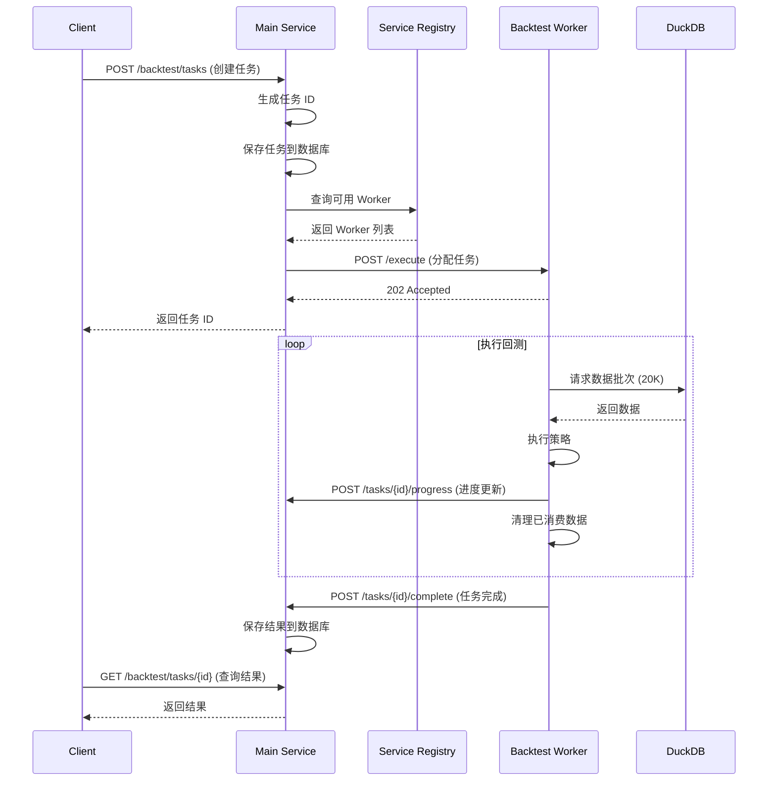

# 架构总览

## 🎯 设计目标

### 当前问题
1. **内存溢出**：处理大数据集（1580万条）时 Node.js OOM
2. **资源竞争**：回测与 API 服务共享资源，相互影响
3. **扩展性差**：无法并行运行多个回测任务
4. **恢复困难**：回测失败需要重新开始

### 解决方案
1. **服务隔离**：独立的回测执行服务
2. **流式处理**：滑动窗口 + 按需加载
3. **内存可控**：固定内存占用（< 500 MB）
4. **水平扩展**：支持多实例部署

## 🏗️ 系统架构

### 整体架构

```
┌──────────────────────────────────────────────────────────────┐
│                     Client (Browser)                          │
└───────────────────────────┬──────────────────────────────────┘
                            │ HTTP/WebSocket
                            ▼
┌────────────────────────────────────────────────────────────────┐
│                  Main Service (Port 3000)                       │
│                                                                 │
│  ┌─────────────────────┐    ┌──────────────────────────┐      │
│  │  API Controllers    │    │  Background Jobs          │      │
│  │  - 数据集管理        │    │  - 任务调度               │      │
│  │  - 策略管理          │    │  - 结果收集               │      │
│  │  - 回测任务管理      │    │  - 状态监控               │      │
│  └─────────────────────┘    └──────────────────────────┘      │
│                                                                 │
│  ┌──────────────────────────────────────────────────────┐     │
│  │  Core Services                                        │     │
│  │  - ServiceRegistry（服务注册表）                      │     │
│  │  - TaskQueue（任务队列）                              │     │
│  │  - BacktestOrchestrator（回测编排器）                │     │
│  └──────────────────────────────────────────────────────┘     │
│                                                                 │
└──────────────────┬──────────────────────┬──────────────────────┘
                   │                      │
                   │ HTTP REST API        │ Service Registry
                   │                      │
      ┌────────────┴────────────┐        │
      │                         │        │
      ▼                         ▼        ▼
┌──────────────┐      ┌──────────────┐  
│ Backtest     │      │ Backtest     │  ... (动态扩展)
│ Worker 1     │      │ Worker 2     │  
│ Port: 3001   │      │ Port: 3002   │  
└──────┬───────┘      └──────┬───────┘  
       │                     │
       │    ┌────────────────┘
       │    │
       ▼    ▼
┌─────────────────────────────────┐
│  Data Layer                     │
│  ┌─────────────────────────┐   │
│  │  PostgreSQL              │   │
│  │  - 任务状态              │   │
│  │  - 回测结果              │   │
│  └─────────────────────────┘   │
│  ┌─────────────────────────┐   │
│  │  DuckDB + Parquet        │   │
│  │  - 历史行情数据          │   │
│  │  - 多时间框架预聚合      │   │
│  └─────────────────────────┘   │
└─────────────────────────────────┘
```

## 🔄 数据流

### 回测任务执行流程



### 数据流式加载流程

```
DuckDB Parquet Files
         │
         ▼
   ┌──────────────┐
   │  Data Loader │  批次加载 (20K 条/批)
   └──────┬───────┘
          │
          ▼
   ┌──────────────────────────────┐
   │  Memory Buffer               │
   │  ┌────────┬────────┬───────┐ │
   │  │ Batch1 │ Batch2 │Batch3 │ │  滑动窗口
   │  └────────┴────────┴───────┘ │
   │         60K 条（固定）        │
   └──────┬───────────────────────┘
          │
          ▼
   ┌──────────────┐
   │   Strategy   │  逐条消费
   │   Executor   │
   └──────┬───────┘
          │
          ▼
   ┌──────────────┐
   │  Result      │  结果聚合
   │  Aggregator  │
   └──────┬───────┘
          │
          ▼
   PostgreSQL (保存结果)
```

## 📦 核心组件

### 1. Main Service（主服务）

**职责**：
- API 接入层
- 任务管理（创建、查询、取消）
- Worker 管理（注册、心跳、负载均衡）
- 结果存储与查询

**技术栈**：
- NestJS
- TypeORM + PostgreSQL
- Bull (可选，用于任务队列)

### 2. Backtest Worker（回测执行器）

**职责**：
- 执行回测任务
- 数据流式加载
- 策略执行
- 进度上报

**技术栈**：
- Node.js (独立进程)
- Express (轻量级 HTTP 服务)
- DuckDB (数据查询)
- RxJS (流式处理)

### 3. Service Registry（服务注册表）

**职责**：
- Worker 注册与注销
- 健康检查（心跳）
- 负载均衡（选择空闲 Worker）
- 故障转移

**实现方式**：
```typescript
class ServiceRegistry {
  private workers: Map<string, WorkerInfo> = new Map()
  
  register(worker: WorkerInfo): void {
    this.workers.set(worker.id, {
      ...worker,
      registeredAt: Date.now(),
      lastHeartbeat: Date.now(),
      status: 'idle',
    })
  }
  
  heartbeat(workerId: string): void {
    const worker = this.workers.get(workerId)
    if (worker) {
      worker.lastHeartbeat = Date.now()
    }
  }
  
  selectWorker(): WorkerInfo | null {
    // 负载均衡策略：选择空闲且负载最低的 Worker
    const idleWorkers = Array.from(this.workers.values())
      .filter(w => w.status === 'idle')
      .sort((a, b) => a.currentLoad - b.currentLoad)
    
    return idleWorkers[0] || null
  }
}
```

## 🔌 通信协议

### API 规范

#### 1. Worker 注册
```http
POST /api/internal/workers/register
Content-Type: application/json

{
  "workerId": "worker-1",
  "host": "localhost",
  "port": 3001,
  "capabilities": {
    "maxConcurrentTasks": 1,
    "supportedStrategies": ["*"]
  }
}
```

#### 2. 任务分配
```http
POST /execute
Content-Type: application/json

{
  "taskId": "task-123",
  "config": {
    "strategyId": "strategy-1",
    "datasetId": 1,
    "timeRange": {
      "start": "2023-01-01T00:00:00Z",
      "end": "2023-06-30T00:00:00Z"
    },
    "timeframe": "1m",
    "parameters": {...}
  }
}
```

#### 3. 进度上报
```http
POST /api/internal/tasks/{taskId}/progress
Content-Type: application/json

{
  "workerId": "worker-1",
  "progress": 0.45,
  "processedBars": 450000,
  "totalBars": 1000000,
  "currentTime": "2023-03-15T10:30:00Z",
  "metrics": {
    "memoryUsed": 450,
    "throughput": 12000
  }
}
```

#### 4. 心跳
```http
POST /api/internal/workers/{workerId}/heartbeat
Content-Type: application/json

{
  "status": "busy",
  "currentLoad": 1,
  "metrics": {
    "cpu": 0.65,
    "memory": 450
  }
}
```

## 🎛️ 配置管理

### Main Service 配置
```typescript
// config/backtest.config.ts
export default {
  worker: {
    heartbeatInterval: 10000,      // 心跳间隔 10s
    heartbeatTimeout: 30000,       // 心跳超时 30s
    maxRetries: 3,                 // 最大重试次数
    taskTimeout: 3600000,          // 任务超时 1h
  },
  registry: {
    cleanupInterval: 60000,        // 清理间隔 1min
    workerTimeout: 60000,          // Worker 超时 1min
  },
}
```

### Worker 配置
```typescript
// worker/config.ts
export default {
  server: {
    port: process.env.WORKER_PORT || 3001,
    host: 'localhost',
  },
  mainService: {
    url: 'http://localhost:3000',
    registerPath: '/api/internal/workers/register',
  },
  execution: {
    batchSize: 20000,              // 批次大小
    bufferSize: 3,                 // 缓冲批次数
    preloadThreshold: 0.2,         // 预加载阈值
    historyWindowSize: 500,        // 历史窗口大小
  },
  memory: {
    maxUsageMB: 500,               // 最大内存使用
    gcThreshold: 0.8,              // GC 触发阈值
  },
}
```

## 📊 监控指标

### Worker 指标
- **内存使用**：当前内存占用（MB）
- **吞吐量**：bars/second
- **任务进度**：已处理/总数
- **缓冲区状态**：当前批次数/缓冲区大小

### 系统指标
- **活跃 Worker 数**
- **待处理任务数**
- **平均任务耗时**
- **成功率**

## 🔒 容错机制

1. **Worker 故障**
   - 心跳超时 → 标记为 down
   - 任务自动转移到其他 Worker

2. **网络故障**
   - HTTP 重试机制（指数退避）
   - 超时自动放弃

3. **数据加载失败**
   - 记录失败位置
   - 支持从断点继续

4. **任务超时**
   - 可配置超时时间
   - 超时自动取消并清理资源

---

**下一步**：查看 [服务隔离方案](./02-service-isolation.md)

