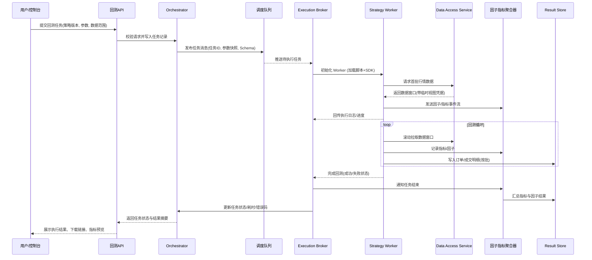

# 回测系统架构设计

## 1. 概述
- **目标**：支撑量化策略回测任务的配置、调度、执行与结果沉淀，确保计算隔离、数据可控、指标可追溯。
- **技术选型**：后端服务采用 Bun 运行时，以 NestJS + TypeScript 实现；回测执行层使用 Bun Worker Threads 运行策略脚本，统一调度。
- **设计原则**：
  - 与交易数据管理模块解耦，所有数据访问通过受控 SDK。
  - 回测任务全链路可追踪，状态机驱动并支持重试。
  - 预留扩展；MVP 内聚为单服务多线程，后续支持分布式伸缩。

## 2. 关键组件

### 2.1 调度编排层（Backtest Orchestrator）
- 接收来自 API/控制台的任务请求，校验策略版本、参数实例、数据窗口等配置。
- 持久化任务元数据（提交人、策略版本、参数快照、优先级），生成任务 ID。
- 解析策略提供的变量/因子 JSON Schema，结合用户输入生成参数快照与前端渲染配置（表单布局、筛选器类型、枚举值）。
- 将任务投递至内部队列（例如基于 Redis Stream / RabbitMQ），维护状态机（Submitted → Queued → Running → Succeeded/Failed/Cancelled）。
- 记录重试次数、错误码、资源用时；提供查询接口给控制台与监控系统。

### 2.2 执行代理层（Execution Broker）
- 持续拉取队列任务，协调 Bun Worker 池。
- 维护 Worker 心跳、并发配额、优先级调度策略；支持手动终止、失败重试。
- 管理执行上下文：注入配置、参数、数据访问凭据，创建日志管道。
- 失败后记录上下文快照（错误堆栈、参数、最近日志），便于排障。

### 2.3 策略执行层（Strategy Workers）
- 每个任务生成独立 Bun Worker 线程，加载策略脚本（原生 TypeScript）并注入 SDK。
- Worker 在沙箱内运行：限制文件系统访问、禁止网络调用，只允许与主线程通信。
- 生命周期钩子：`onInit` → `onData`（按时间推进）/扩展钩子 → `onFinalize`。
- 与数据服务、指标聚合器通过消息通道交互，实时回传日志、进度与因子数据。
- **交易时段控制**：引擎根据配置的交易时段（RTH/ETH/自定义）过滤行情数据，仅在指定时段内调用策略的 onBar 方法；非交易时段持仓保持但不触发策略逻辑。
- **风险约束监控**：引擎在平台层面监控账户状态，当触发最大回撤或单日最大亏损限制时，强制平仓并记录风控事件，策略脚本无需感知。
- **因子采集**：策略通过 SDK 在交易时记录自定义因子（如 RSI、趋势、入场原因等）；引擎自动补充系统默认因子（交易时段、持仓时长、账户净值等），统一存储用于后续分析。

### 2.4 数据访问层（Data Access Service）
- 将任务请求映射到交易数据模块的数据集，实现按交易对/粒度/时间区间的抽象视图。
- 每个回测任务创建独立的临时视图（DuckDB 虚表或内存管道），以确保读操作隔离。
- 提供分页/时间窗口加载、缓存预取、字段裁剪能力，避免策略脚本直接访问底层存储。
- 支持多数据源（OHLCV、成交明细、特征因子），按需扩展数据管道。

### 2.5 因子与指标聚合器（Factor & Metrics Aggregator）
- 消费 Worker 产生的事件流，实时累计基础绩效指标（收益、回撤、夏普等）。
- 统一接收策略记录的自定义因子和引擎采集的系统默认因子，依据元数据建立索引（类型、时间戳、交易ID）。
- 负责写入结果存储（指标 JSON、因子序列、订单流水）并生成快照文件。
- 支持因子分析视图的创建：根据筛选条件过滤交易数据，重新计算指标，生成独立分析报告。

### 2.6 结果存储与导出（Result Store）
- 元数据与任务状态：PostgreSQL。
- 大体量时序数据：DuckDB + Parquet（按任务/策略分区），提供高效读取接口。
- 因子数据存储：每笔交易记录包含自定义因子和系统因子的完整快照，支持快速筛选和聚合查询。
- 因子分析视图：存储视图配置（筛选条件、视图名称）和视图结果（指标、交易子集），支持多视图对比。
- 报表/图表文件：对象存储或文件系统（根据部署环境）。
- 提供导出接口，支持 PDF/Excel 生成以及原始数据下载权限控制。

### 2.7 API 与控制台接口
- 开放任务提交、状态查询、日志/因子拉取、指标分析的 REST/GraphQL 接口。
- 与策略管理模块联动：选择策略版本、参数模板、自定义变量表单；通过 JSON Schema + `x-ui`/`x-filter` 扩展自动生成控制台的录入与筛选器配置。
- 支持交易时段配置（预设模板 RTH/ETH、自定义时段、多时段组合）和风险约束配置。
- 提供因子分析视图的创建、编辑、查询接口；支持按因子筛选条件生成独立分析报告和多视图对比。
- 实时推送进度、风控事件与告警（WebSocket/SSE），并支持任务终止、重试操作。

## 3. 数据与控制流
1. 用户通过控制台提交任务（策略版本、参数实例、数据范围、交易时段、风险约束、自定义变量、因子设置）。
2. Orchestrator 校验配置、写入任务表、发布到队列。
3. Execution Broker 取出任务、分配 Worker，初始化 SDK、日志、数据视图、交易时段过滤器、风险约束监控器。
4. Worker 通过 SDK 拉取数据、根据交易时段配置过滤行情数据、执行策略逻辑、触发订单/指标/因子记录。
5. 引擎监控风险约束，触发时强制平仓并记录风控事件；策略记录自定义因子，引擎自动补充系统默认因子。
6. Aggregator 接收事件流，实时累积指标和因子数据，写入 Result Store，并输出进度。
7. 任务完成后，Orchestrator 更新状态，生成执行总结（耗时、指标快照、输出文件列表、风控触发记录）。
8. 用户在控制台查看基准报告、创建因子分析视图、进行多视图对比、导出报表；任务可复制配置重新发起。

## 4. 运行时与基础设施
- **运行时**：Bun 1.x，支持原生 TypeScript，worker 通过 `new Worker(import.meta.url, { worker: true })` 创建。
- **依赖管理**：主服务统一管理依赖；策略脚本只允许引用 SDK 暴露的白名单包。
- **日志**：Worker 使用结构化日志（JSON Lines）写回主线程；Orchestrator 将日志切分为实时流与存档文件。
- **监控指标**：
  - 任务吞吐量、成功率、平均耗时。
  - Worker 并发数、队列长度、失败原因分类。
  - 数据读取延迟、因子计算耗时、存储写入时延。
- **扩展路径**：
  - 拆分 Execution Broker、Aggregator 为独立服务，通过消息队列或 gRPC 通信。
  - 引入弹性资源管理（Kubernetes + Horizontal Pod Autoscaler）。
  - 加入资源配额与超时控制策略。

## 5. 安全与合规
- 上传策略脚本需通过静态检查（ESLint/TS 类型检查）及依赖白名单审核。
- Worker 沙箱限制文件系统与网络访问，只允许通过 SDK 获取数据。
- 敏感操作（任务终止、删除结果）记录审计日志。
- 因子、变量元数据与执行参数保留审计历史，便于回溯。

## 6. 与其他模块的集成
- **策略管理模块**：提供策略脚本版本、参数模板、自定义变量 schema，回测任务引用其快照。
- **前端表单引擎**：消费 JSON Schema 和扩展元数据，自动生成策略参数向导与回测结果筛选器；与后端保持 schema 版本同步。
- **交易数据管理模块**：通过 Data Access Service 间接访问数据集实体（`DatasetEntity`），支持按标签、交易对选择数据。
- **监控与告警**：Prometheus 收集运行指标，Grafana 展示；关键失败推送到告警渠道。
- **权限体系**：集成统一认证授权（Role/Team），控制策略访问、任务操作、结果下载权限。

## 7. 回测执行时序图
- 展示一次回测任务从用户提交到结果落地的核心交互，覆盖数据读取与指标沉淀全过程。
- 通过顺序图体现 Orchestrator、Execution Broker、Strategy Worker、数据服务与结果存储之间的消息流与依赖关系。

