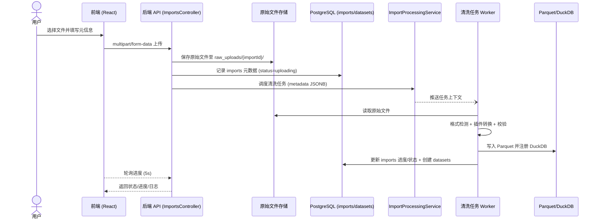

# 交易数据导入与清洗设计

本文档记录当前阶段的 OHLCV 数据导入、清洗与存储方案，作为后续实现与协作的依据。

## 导入流程概览

单次导入处理一个原始文件，由人工触发，统一经过以下步骤：

1. **格式检测**：根据文件扩展名或头部特征识别支持的格式（zst/CSV/JSON 等），并匹配对应插件。
2. **数据转换**：调用插件读取原始数据，按平台统一 OHLCV 标准产出记录流（时间戳、开高低收、成交量等）。
3. **数据汇总**：在转换过程中统计时间范围、记录数量、校验值（如 MD5/CRC）。
4. **写入存储**：生成 Parquet 文件落盘，并通过 DuckDB 进行查询注册。
5. **元数据入库**：将数据集描述与导入纪录写入 PostgreSQL，方便检索与运营追踪。

数据一旦清洗完成即视为只读，不支持对既有时间范围内的数据覆盖和修改，仅允许在时间轴两端追加新的增量数据。
在前端通过 TradingView 图表查看数据时，后端会基于原始 Parquet 批次按需聚合：
- 请求的时间粒度需大于等于数据集基础粒度，并为其整数倍；
- 读取与查询时间范围有交集的所有批次文件；
- 使用 DuckDB 将高频数据按秒数桶化，取桶内第一条/最大/最小/最后一条记录生成开高低收，成交量求和；
- 直接返回聚合后的烛线序列，无需额外存储预聚合结果。

## 插件约定

考虑到数据源类型有限，目前采用轻量的硬编码插件方式，每种格式实现一个插件（如 `CsvOhlcvPlugin`、`JsonOhlcvPlugin`）。插件需实现以下约定接口：

- `supports(format: string): boolean`：判断是否支持指定格式。
- `transform(rawPath: string, context): Iterable<OhlcvRecord>`：读取并产出统一字段的 OHLCV 记录。
- `handleError?(rawPath: string, error: Error)`：可选，用于在导入失败时记录额外调试信息。

导入服务内维护一个内存 `PluginRegistry`，插件通过注册函数声明 `name`、`version`、`supportedFormats`。执行时根据格式选择唯一插件运行。

### 统一数据模式

标准 OHLCV 记录字段：

- `timestamp`: 交易时间（UTC）
- `open`, `high`, `low`, `close`: 价格
- `volume`: 成交量
- 可扩展附加字段：`turnover`、`open_interest` 等

所有额外字段需在数据集标签或描述中登记，便于后续分析侧识别。

## 存储策略

### 数据湖存储

- 数据统一输出为标准化的 OHLCV 结构（`timestamp`、`open`、`high`、`low`、`close`、`volume` 等扩展字段），并直接写入 Parquet 文件，确保类型约束与列式压缩效果。
- 存储路径：`/datasets/{source-or-unknown}/{trading_pair}/{granularity}/dt={YYYY-MM-DD}/hour={HH}/batch_{importId}.parquet`。按交易时间做日/小时目录切分，确保大批量导入可以被分片读取；粒度高于小时的场景可保留单文件但仍复用目录规范。
- 每个批次文件需在元数据中记录时间范围、记录数、校验值（MD5/CRC），保证任务追溯性与数据校验。
- DuckDB 通过外部表注册访问 Parquet 文件，可在后续按粒度或时间范围做分区优化。

### PostgreSQL 元数据

两张核心表即可支撑当前需求：

```sql
CREATE TABLE datasets (
  dataset_id      SERIAL PRIMARY KEY,
  source          TEXT,
  trading_pair    TEXT NOT NULL,
  granularity     TEXT NOT NULL,
  path            TEXT NOT NULL,
  time_start      TIMESTAMPTZ NOT NULL,
  time_end        TIMESTAMPTZ NOT NULL,
  row_count       BIGINT NOT NULL,
  checksum        TEXT NOT NULL,
  labels          JSONB DEFAULT '{}'::JSONB,
  description     TEXT,
  created_by      TEXT,
  updated_by      TEXT,
  created_at      TIMESTAMPTZ DEFAULT now(),
  updated_at      TIMESTAMPTZ DEFAULT now(),
  deleted_at      TIMESTAMPTZ
);

CREATE INDEX idx_datasets_lookup
  ON datasets (COALESCE(source, 'unknown'), trading_pair, granularity, time_start)
  WHERE deleted_at IS NULL;

CREATE TABLE imports (
  import_id         SERIAL PRIMARY KEY,
  dataset_id        INTEGER REFERENCES datasets(dataset_id) ON DELETE SET NULL,
  source_file       TEXT NOT NULL,
  stored_file_path  TEXT NOT NULL,
  metadata          JSONB,
  plugin_name       TEXT NOT NULL,
  plugin_version    TEXT NOT NULL,
  status            TEXT NOT NULL,
  progress          NUMERIC(5,2) DEFAULT 0,
  stage             TEXT,
  message           TEXT,
  error_log         TEXT,
  created_by        TEXT,
  updated_by        TEXT,
  started_at        TIMESTAMPTZ DEFAULT now(),
  finished_at       TIMESTAMPTZ,
  created_at        TIMESTAMPTZ DEFAULT now(),
  updated_at        TIMESTAMPTZ DEFAULT now()
);

CREATE INDEX idx_imports_status ON imports (status);
CREATE INDEX idx_imports_dataset ON imports (dataset_id);
```

`datasets` 记录清洗后数据集的存放位置与统计信息，`labels` 字段承载去重后的自定义标签集合（标签在入库前应去除首尾空格并控制在 25 字以内），并通过 `deleted_at` 字段实现软删除（后续可将 `deleted_at` 置空实现恢复）；`imports` 用于跟踪导入任务状态，同时保留完整错误日志字段与 `metadata` JSONB，用于存放导入表单提交的来源、交易对、时间范围等信息，便于异步清洗流程引用。两张表均预留 `created_by`、`updated_by` 字段，方便未来接入权限与审计能力。

追加写入产生的分片落在新增的 `dataset_batches` 表中，字段包含 `dataset_id`、`import_id`、`path`、`time_start`、`time_end`、`row_count`、`checksum` 及 `created_at`，用于追踪每次追加生成的 Parquet 批次，便于审计与回溯。

> 数据库迁移建议使用 NestJS TypeORM 的 migration 机制统一管理上述表结构与字段调整。

### 原始文件存储

- 上传成功后将原始文件落盘至 `raw_uploads/{importId}/` 目录，并在 `imports.source_file` 中记录相对路径。
- 保留周期不少于 7 天，以支撑失败任务重试、插件排查和合规审计；清理策略由运维定期执行。
- 当用户选择“沿用原文件”重试时，直接引用该目录下的既有文件，无需再次上传。

## 任务状态与进度

导入任务遵循简化状态机：

- `pending`：创建任务，等待执行；
- `running`：正在处理，定期更新 `imports.progress`（0-100）；
- `completed`：导入成功，写入 `finished_at` 并将进度设为 100；
- `failed`：导入失败，记录错误摘要在 `message` 字段，并将完整日志写入 `error_log`；可选触发插件 `handleError`。

导入服务需在每个阶段（读取、转换、写入、入库）更新状态，确保使用者可以实时了解当前进度与最终结果；若失败，可直接复用原任务上下文重新上传或清洗。

## 数据流转时序



## 模块架构概览

```mermaid
graph TD
    subgraph Frontend
        A[React Admin] -->|REST / multipart| B
    end
    subgraph Backend (NestJS)
        B[ImportsController] --> C[TradingDataService]
        C --> D[ImportProcessingService]
        C -->|TypeORM| DB[(PostgreSQL)]
        C -->|fs| Raw[((raw_uploads))]
    end
    subgraph Async Worker
        E[Import Worker] -->|读写| Raw
        E --> Lake[(Parquet + DuckDB)]
        E -->|TypeORM| DB
    end

    D -->|Queue/调度| E
    style Raw fill:#eef,stroke:#89a
    style DB fill:#eef,stroke:#89a
    style Lake fill:#eef,stroke:#89a
```

> **说明**
>
> - **ImportsController**：负责接收文件上传、更新导入状态、提供错误日志下载。
> - **TradingDataService**：封装元数据写入、标签处理、软删除/恢复等业务逻辑。
> - **ImportProcessingService**：清洗任务的调度入口，后续可接入 BullMQ、Kafka 等消息系统。
> - **Import Worker**：独立进程执行格式检测、插件转换、Parquet 写入以及 DuckDB 注册。

## 后续工作

1. 根据本约定编写插件 SDK 及示例实现，验证统一输出格式。
2. 编写导入服务逻辑，将状态更新写入 `imports` 表并生成 `datasets` 记录。
3. 设计导入触发与监控界面，展示任务状态、进度与基础日志。
