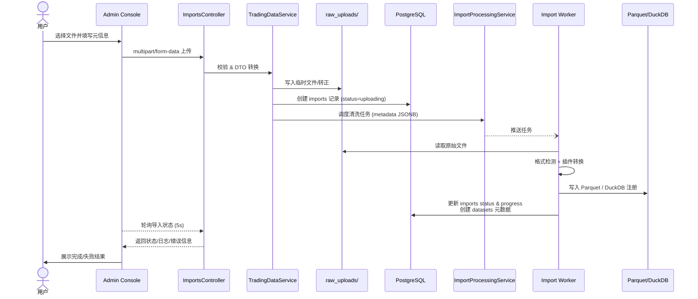

# 交易分析平台系统架构设计

本文档提供平台整体架构视图与关键流程时序，帮助开发者快速入门并在各子模块协作时保持一致的理解。

## 1. 总体架构

平台采用前后端分离 + 任务异步处理的分层架构，核心组件如下：

- **客户端层**
  - Admin Console（React + Ant Design）：运营、研究人员管理数据、导入任务、策略配置。
  - Analyst Console（后续规划）：提供可视化、报表能力。

- **服务层（NestJS）**
  - API Gateway：统一路由入口、认证、限流。
  - Trading Data Service：交易数据导入、元数据维护、清洗进度管理。
  - Strategy/Backtest Service（规划中）：策略编排、回测调度、结果存储。
  - Auth & User Service：账号体系、权限。

- **异步处理层**
  - Import Worker：对接 ImportProcessingService 队列，执行格式检测、数据清洗、Parquet 写入。
  - Backtest Worker / Analytics Worker（规划中）：处理长耗时任务。

- **存储层**
  - PostgreSQL：主业务数据库（元数据、任务记录、策略配置）。
  - Redis：缓存、会话、短期状态。
  - Parquet + DuckDB：历史行情数据湖 + OLAP 查询。
  - Object Storage（可选）：原始文件归档。

- **外部系统**
  - 市场数据源（交易所、第三方数据）；
  - CI/CD、监控告警、身份认证（SSO）等基础设施。

```mermaid
graph TD
    subgraph Clients
        A[Admin Console] -->|HTTPS| G(API Gateway)
        B[Analyst Console] -->|HTTPS| G
    end

    subgraph Backend Services (NestJS)
        G --> TD[Trading Data Service]
        G --> ST[Strategy / Backtest Service]
        G --> AU[Auth Service]
        TD -->|TypeORM| DB[(PostgreSQL)]
        TD -->|Redis Cache| RS[(Redis)]
        TD -->|fs/obj| RAW[((raw_uploads))]
    end

    subgraph Async Workers
        TD --> Q((Import Queue))
        Q --> IW[Import Worker]
        IW --> RAW
        IW --> OLAP[(Parquet + DuckDB)]
        IW --> DB
        ST --> BQ((Backtest Queue))
        BQ --> BW[Backtest Worker]
        BW --> OLAP
        BW --> DB
    end

    External[Market Data Providers] -->|拉取/订阅| IW
    Monitor[Monitoring & Alerting] --> G
```

## 2. 数据导入时序

以下时序图针对交易数据导入，从用户上传到清洗落盘的全过程，涵盖前端、后端以及 Worker 的协作关系。



## 3. 关键模块职责

| 模块 | 职责 | 关键技术 |
| --- | --- | --- |
| Admin Console | 数据导入、元数据维护、进度查看、策略配置 | React、Ant Design、Vite |
| API Gateway | 统一入口、认证、路由 | NestJS |
| Trading Data Service | 文件上传、imports/datasets 元数据管理、清洗任务调度 | NestJS、TypeORM、Multer |
| ImportProcessingService | 将导入任务推送至队列/Worker，抽象清洗调度逻辑 | NestJS Provider、BullMQ（规划） |
| Import Worker | 文件解析、插件执行、Parquet 写入、DuckDB 注册 | Node.js Worker/独立服务 |
| PostgreSQL | 保存元数据、任务状态、策略配置 | Postgres 15 |
| Parquet + DuckDB | 历史行情数据存储与分析查询 | DuckDB、Parquet |
| Redis | Session 缓存、短期状态、限流 | Redis 7 |

## 4. 后续扩展

- **消息队列**：将当前的调度占位实现替换为 BullMQ / Kafka，以支持水平扩展与失败重试。
- **多环境部署**：结合 Kubernetes / Docker Compose，制定 Dev / Staging / Prod 的部署拓扑及监控策略。
- **策略/回测链路**：补充回测任务的时序图与架构图，涵盖策略编译、执行、结果回写。
- **安全体系**：设计并文档化 OAuth2/SSO、审计日志、合规要求等。

> 本文档与《交易数据导入与清洗设计》互为补充：前者提供平台级视图，后者聚焦导入链路的细节实现。请在重大架构或流程变更后同步更新两份文档。
