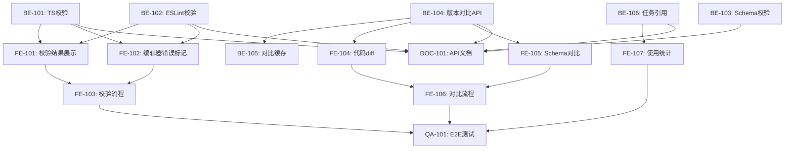

# Phase 1: 策略管理完善 - 详细任务清单

> **阶段**: Phase 1  
> **时间**: 2024-11-09 ~ 2024-11-13 (5天)  
> **目标**: 完成策略管理模块的脚本校验、版本对比和审计功能  
> **状态**: 🟡 进行中

---

## 📋 任务总览

| Sprint | 任务数 | 预计工时 | 状态 |
|--------|--------|----------|------|
| Sprint 1.1: 脚本校验增强 | 6 | 2天 | 📅 待开始 |
| Sprint 1.2: 版本对比功能 | 5 | 2天 | 📅 待开始 |
| Sprint 1.3: 审计与文档 | 4 | 1天 | 📅 待开始 |
| **总计** | **15** | **5天** | - |

---

## Sprint 1.1: 脚本校验增强 (2天)

### 后端任务

#### 📌 BE-101: TypeScript类型检查服务
**优先级**: P0  
**负责人**: 后端开发1  
**预计工时**: 1天  
**依赖**: 无

**任务描述**:
实现TypeScript类型检查服务，用于验证策略脚本的类型正确性。

**技术要点**:
- 集成`tsc --noEmit`命令
- 在沙箱环境中执行（避免安全问题）
- 解析TypeScript编译器输出
- 转换为结构化错误格式

**验收标准**:
- [ ] 能够检测TypeScript类型错误
- [ ] 返回结构化错误信息（文件、行号、列号、消息）
- [ ] 执行超时控制（< 3秒）
- [ ] 资源限制（内存、CPU）
- [ ] 单元测试覆盖率 ≥ 80%

**API接口**:
```typescript
POST /api/backtesting/strategies/:id/script-versions/validate
Request: {
  code: string;
  dependencies?: string[];
}
Response: {
  valid: boolean;
  errors: Array<{
    file: string;
    line: number;
    column: number;
    message: string;
    severity: 'error' | 'warning';
  }>;
  executionTime: number;
}
```

**相关文件**:
- `backend/src/backtesting/strategy/validators/typescript-validator.service.ts`
- `backend/src/backtesting/strategy/validators/typescript-validator.spec.ts`

---

#### 📌 BE-102: ESLint校验服务
**优先级**: P0  
**负责人**: 后端开发1  
**预计工时**: 0.5天  
**依赖**: 无

**任务描述**:
实现ESLint校验服务，检查代码规范和潜在问题。

**技术要点**:
- 集成ESLint引擎
- 配置规则集（基于项目规范）
- 支持自定义规则
- 错误分级（error/warning/info）

**验收标准**:
- [ ] 能够检测代码规范问题
- [ ] 支持可配置的规则集
- [ ] 返回结构化错误信息
- [ ] 执行超时控制
- [ ] 单元测试覆盖率 ≥ 80%

**ESLint配置**:
```json
{
  "extends": ["eslint:recommended", "plugin:@typescript-eslint/recommended"],
  "rules": {
    "no-console": "warn",
    "no-unused-vars": "error",
    "@typescript-eslint/no-explicit-any": "warn"
  }
}
```

**相关文件**:
- `backend/src/backtesting/strategy/validators/eslint-validator.service.ts`
- `backend/src/backtesting/strategy/validators/eslint-validator.spec.ts`
- `backend/src/backtesting/strategy/validators/eslint.config.json`

---

#### 📌 BE-103: Schema解析与校验
**优先级**: P0  
**负责人**: 后端开发2  
**预计工时**: 0.5天  
**依赖**: 无

**任务描述**:
实现参数Schema和因子Schema的解析与校验逻辑。

**技术要点**:
- 在沙箱中执行策略脚本
- 解析导出的parameters和factors
- 校验Schema字段完整性
- 检查字段唯一性和类型

**验收标准**:
- [ ] 能够解析策略导出的Schema
- [ ] 校验必填字段（key, label, type）
- [ ] 检查字段唯一性
- [ ] 验证type与component的匹配
- [ ] 单元测试覆盖率 ≥ 80%

**Schema示例**:
```typescript
// 策略脚本中的定义
export const parameters = {
  period: {
    key: 'period',
    label: '周期',
    type: 'number',
    component: 'number',
    defaultValue: 20,
    required: true,
    validator: (v) => v > 0 && v <= 100
  }
};
```

**相关文件**:
- `backend/src/backtesting/strategy/validators/schema-validator.service.ts`
- `backend/src/backtesting/strategy/validators/schema-validator.spec.ts`

---

### 前端任务

#### 📌 FE-101: 校验结果展示组件
**优先级**: P0  
**负责人**: 前端开发1  
**预计工时**: 1天  
**依赖**: BE-101, BE-102

**任务描述**:
创建校验结果展示组件，清晰地展示TypeScript和ESLint的校验错误。

**技术要点**:
- 错误列表面板（可折叠）
- 错误分类（TypeScript/ESLint）
- 错误分级（error/warning/info）
- 点击跳转到错误行

**验收标准**:
- [ ] 清晰展示所有错误
- [ ] 支持按类型和级别筛选
- [ ] 点击错误可跳转到代码行
- [ ] 显示错误统计（总数、error数、warning数）
- [ ] 组件单元测试

**组件设计**:
```tsx
<ValidationPanel
  errors={validationErrors}
  onErrorClick={(error) => editor.revealLine(error.line)}
  showTypeScriptErrors={true}
  showESLintErrors={true}
/>
```

**相关文件**:
- `frontend/src/modules/backtesting/components/ValidationPanel.tsx`
- `frontend/src/modules/backtesting/components/ValidationPanel.spec.tsx`
- `frontend/src/modules/backtesting/components/ValidationPanel.less`

---

#### 📌 FE-102: Monaco编辑器错误标记
**优先级**: P0  
**负责人**: 前端开发1  
**预计工时**: 1天  
**依赖**: BE-101, BE-102

**任务描述**:
在Monaco编辑器中集成错误标记功能，实时显示校验错误。

**技术要点**:
- Monaco Editor Markers API
- 错误下划线高亮
- Hover提示详情
- 实时校验（防抖）

**验收标准**:
- [ ] 错误行有红色波浪线标记
- [ ] 警告行有黄色波浪线标记
- [ ] Hover显示错误详情
- [ ] 支持实时校验（保存时触发）
- [ ] 性能优化（大文件不卡顿）

**实现示例**:
```typescript
monaco.editor.setModelMarkers(model, 'typescript', [
  {
    startLineNumber: 10,
    startColumn: 5,
    endLineNumber: 10,
    endColumn: 15,
    message: 'Type "string" is not assignable to type "number"',
    severity: monaco.MarkerSeverity.Error
  }
]);
```

**相关文件**:
- `frontend/src/modules/backtesting/components/ScriptEditor.tsx`
- `frontend/src/modules/backtesting/hooks/useScriptValidation.ts`

---

#### 📌 FE-103: 校验触发与流程
**优先级**: P0  
**负责人**: 前端开发1  
**预计工时**: 0.5天  
**依赖**: BE-101, BE-102, FE-101, FE-102

**任务描述**:
实现校验触发逻辑和完整的校验流程。

**技术要点**:
- 保存时自动触发校验
- 手动触发校验按钮
- 校验中的Loading状态
- 校验失败阻止保存

**验收标准**:
- [ ] 保存时自动校验
- [ ] 校验中显示Loading
- [ ] 校验失败阻止保存并提示
- [ ] 校验成功允许保存
- [ ] 用户体验流畅

**相关文件**:
- `frontend/src/modules/backtesting/pages/StrategyDetail.tsx`
- `frontend/src/modules/backtesting/hooks/useStrategyValidation.ts`

---

## Sprint 1.2: 版本对比功能 (2天)

### 后端任务

#### 📌 BE-104: 版本对比API
**优先级**: P0  
**负责人**: 后端开发2  
**预计工时**: 1天  
**依赖**: 无

**任务描述**:
实现版本对比API，返回两个版本之间的代码和Schema差异。

**技术要点**:
- 使用diff算法（如jsdiff库）
- 代码分段diff
- Schema字段级对比
- 差异统计

**验收标准**:
- [ ] 返回代码diff（行级差异）
- [ ] 返回Schema diff（字段级差异）
- [ ] 支持多种diff格式（unified/split）
- [ ] 性能优化（大文件对比 < 1秒）
- [ ] 单元测试覆盖率 ≥ 80%

**API接口**:
```typescript
GET /api/backtesting/strategies/:id/script-versions/:versionId/diff?compareWith=:compareVersionId
Response: {
  codeDiff: {
    additions: number;
    deletions: number;
    changes: Array<{
      type: 'add' | 'delete' | 'modify';
      lineNumber: number;
      content: string;
    }>;
  };
  schemaDiff: {
    parameters: {
      added: Array<ParameterField>;
      deleted: Array<ParameterField>;
      modified: Array<{
        field: string;
        oldValue: any;
        newValue: any;
      }>;
    };
    factors: { /* 同上 */ };
  };
}
```

**相关文件**:
- `backend/src/backtesting/strategy/services/version-diff.service.ts`
- `backend/src/backtesting/strategy/services/version-diff.spec.ts`

---

#### 📌 BE-105: 对比结果缓存
**优先级**: P1  
**负责人**: 后端开发2  
**预计工时**: 0.5天  
**依赖**: BE-104

**任务描述**:
实现对比结果的缓存机制，提升重复对比的性能。

**技术要点**:
- Redis缓存
- 缓存键设计（版本ID组合）
- TTL设置（1小时）
- 缓存失效策略

**验收标准**:
- [ ] 热点对比从缓存返回
- [ ] 缓存命中率监控
- [ ] 版本更新时自动失效
- [ ] 性能提升明显（< 100ms）

**相关文件**:
- `backend/src/backtesting/strategy/services/version-diff-cache.service.ts`

---

### 前端任务

#### 📌 FE-104: 代码diff视图
**优先级**: P0  
**负责人**: 前端开发2  
**预计工时**: 1.5天  
**依赖**: BE-104

**任务描述**:
实现代码diff视图，清晰展示两个版本的代码差异。

**技术要点**:
- 使用Monaco Diff Editor
- 左右分栏对比
- 行级差异高亮
- 支持折叠/展开

**验收标准**:
- [ ] 清晰展示代码差异
- [ ] 新增行绿色高亮
- [ ] 删除行红色高亮
- [ ] 修改行黄色高亮
- [ ] 支持滚动联动
- [ ] 性能流畅（大文件不卡顿）

**组件设计**:
```tsx
<CodeDiffViewer
  original={oldVersion.code}
  modified={newVersion.code}
  language="typescript"
  theme="vs-dark"
/>
```

**相关文件**:
- `frontend/src/modules/backtesting/components/CodeDiffViewer.tsx`
- `frontend/src/modules/backtesting/components/CodeDiffViewer.less`

---

#### 📌 FE-105: Schema对比视图
**优先级**: P0  
**负责人**: 前端开发2  
**预计工时**: 0.5天  
**依赖**: BE-104

**任务描述**:
实现Schema对比视图，展示参数和因子的字段差异。

**技术要点**:
- 表格展示
- 字段级对比
- 差异标记（新增/删除/修改）
- 差异统计

**验收标准**:
- [ ] 清晰展示Schema差异
- [ ] 新增字段绿色标记
- [ ] 删除字段红色标记
- [ ] 修改字段黄色标记
- [ ] 显示差异统计

**组件设计**:
```tsx
<SchemaDiffViewer
  originalSchema={oldVersion.parameterSchema}
  modifiedSchema={newVersion.parameterSchema}
  type="parameters"
/>
```

**相关文件**:
- `frontend/src/modules/backtesting/components/SchemaDiffViewer.tsx`
- `frontend/src/modules/backtesting/components/SchemaDiffViewer.less`

---

#### 📌 FE-106: 版本对比流程
**优先级**: P0  
**负责人**: 前端开发2  
**预计工时**: 0.5天  
**依赖**: BE-104, FE-104, FE-105

**任务描述**:
实现完整的版本对比流程，包括版本选择、对比展示、模式切换。

**技术要点**:
- 版本选择器（下拉框）
- 对比模式切换（代码/Schema）
- 对比弹窗/页面
- 防止自比自身

**验收标准**:
- [ ] 可选择任意两个版本对比
- [ ] 支持切换对比模式
- [ ] 防止选择相同版本
- [ ] 用户体验流畅

**相关文件**:
- `frontend/src/modules/backtesting/components/VersionCompareModal.tsx`
- `frontend/src/modules/backtesting/pages/VersionCompare.tsx`

---

## Sprint 1.3: 审计与文档 (1天)

### 后端任务

#### 📌 BE-106: 回测任务引用信息
**优先级**: P1  
**负责人**: 后端开发1  
**预计工时**: 0.5天  
**依赖**: 无

**任务描述**:
在策略详情中显示回测任务引用信息。

**技术要点**:
- 查询关联的回测任务
- 显示最近5个任务
- 任务状态与结果快照

**验收标准**:
- [ ] 返回最近5个引用任务
- [ ] 包含任务ID、状态、创建时间
- [ ] 包含收益率快照（如已完成）
- [ ] 查询性能优化

**API接口**:
```typescript
GET /api/backtesting/strategies/:id/script-versions/:versionId/references
Response: {
  tasks: Array<{
    id: string;
    status: string;
    createdAt: string;
    returnRate?: number;
  }>;
  totalCount: number;
}
```

**相关文件**:
- `backend/src/backtesting/strategy/controllers/strategy.controller.ts`
- `backend/src/backtesting/strategy/services/strategy.service.ts`

---

### 前端任务

#### 📌 FE-107: 版本使用统计展示
**优先级**: P1  
**负责人**: 前端开发1  
**预计工时**: 0.5天  
**依赖**: BE-106

**任务描述**:
在版本列表中展示使用统计信息。

**技术要点**:
- 使用次数
- 最后使用时间
- 引用任务列表

**验收标准**:
- [ ] 显示使用次数
- [ ] 显示最后使用时间
- [ ] 点击查看引用任务列表
- [ ] 样式美观

**相关文件**:
- `frontend/src/modules/backtesting/components/VersionList.tsx`
- `frontend/src/modules/backtesting/components/VersionUsageStats.tsx`

---

### QA任务

#### 📌 QA-101: E2E测试编写
**优先级**: P1  
**负责人**: QA  
**预计工时**: 1天  
**依赖**: 所有开发任务

**任务描述**:
编写Phase 1功能的E2E测试用例。

**测试场景**:
1. 策略创建流程
2. 脚本编辑与保存
3. 脚本校验（成功/失败）
4. 版本创建与管理
5. 版本对比
6. 设为master

**验收标准**:
- [ ] 覆盖所有核心流程
- [ ] 测试用例清晰
- [ ] 测试通过率100%
- [ ] 测试报告完整

**相关文件**:
- `frontend/e2e/strategy-management.spec.ts`
- `frontend/e2e/script-validation.spec.ts`
- `frontend/e2e/version-compare.spec.ts`

---

### 文档任务

#### 📌 DOC-101: API文档更新
**优先级**: P1  
**负责人**: 后端开发1  
**预计工时**: 0.5天  
**依赖**: 所有后端任务

**任务描述**:
更新Swagger API文档，包含所有新增接口。

**验收标准**:
- [ ] 所有新增API已文档化
- [ ] 包含请求/响应示例
- [ ] 错误码说明完整
- [ ] Swagger可正常访问

**相关文件**:
- `backend/src/backtesting/strategy/controllers/*.controller.ts`（Swagger装饰器）

---

## 📊 任务依赖关系



---

## 📅 时间安排

### Day 1 (2024-11-09 周六)
- **后端**: BE-101 (TS校验) 开始
- **后端**: BE-103 (Schema校验) 开始
- **前端**: FE-101 (校验结果展示) 准备Mock数据先行开发
- **QA**: 准备测试环境和测试数据

### Day 2 (2024-11-10 周日)
- **后端**: BE-101 完成, BE-102 (ESLint校验) 开始并完成
- **后端**: BE-103 完成
- **前端**: FE-101 完成, FE-102 (编辑器错误标记) 开始
- **后端**: BE-104 (版本对比API) 开始

### Day 3 (2024-11-11 周一)
- **前端**: FE-102 完成, FE-103 (校验流程) 完成
- **后端**: BE-104 完成, BE-105 (对比缓存) 完成
- **前端**: FE-104 (代码diff) 开始
- **技术评审**: 15:00 动态表单渲染器方案评审

### Day 4 (2024-11-12 周二)
- **前端**: FE-104 完成, FE-105 (Schema对比) 完成
- **前端**: FE-106 (对比流程) 完成
- **后端**: BE-106 (任务引用) 完成
- **前端**: FE-107 (使用统计) 完成

### Day 5 (2024-11-13 周三)
- **QA**: QA-101 (E2E测试) 执行
- **后端**: DOC-101 (API文档) 完成
- **全员**: Bug修复与优化
- **全员**: 16:00 Sprint评审会, 17:00 Sprint回顾会

---

## ✅ 验收标准

### 功能验收
- [ ] 脚本保存时自动触发校验
- [ ] 校验错误清晰展示并可定位
- [ ] 任意两个版本可进行对比
- [ ] 代码和Schema差异清晰可见
- [ ] 版本使用统计准确显示

### 质量验收
- [ ] 单元测试覆盖率 ≥ 80%
- [ ] E2E测试通过率 100%
- [ ] 无Critical/High级别Bug
- [ ] API文档完整准确

### 性能验收
- [ ] 脚本校验耗时 < 3秒
- [ ] 版本对比加载 < 1秒
- [ ] 页面操作流畅无卡顿

---

## 🚨 风险提示

1. **TypeScript校验复杂度**
   - 风险: 沙箱执行可能遇到环境问题
   - 缓解: 提前进行技术预研和POC

2. **Monaco Editor集成**
   - 风险: 错误标记可能影响性能
   - 缓解: 实现防抖和性能优化

3. **版本对比性能**
   - 风险: 大文件对比可能较慢
   - 缓解: 实现缓存和分页加载

---

## 📞 联系方式

- **Slack频道**: #trading-backtest-project
- **项目看板**: [GitHub Projects链接]
- **紧急联系**: 项目经理

---

**文档维护**: PM Team  
**最后更新**: 2024-11-09  
**版本**: v1.0

