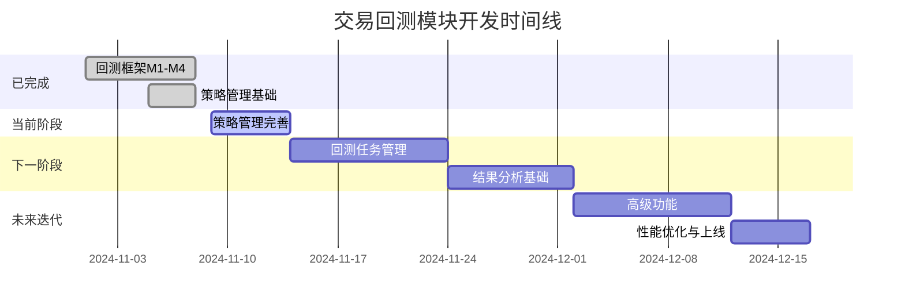

# 交易回测模块项目规划
> **项目经理**: PM Team  
> **创建日期**: 2024-11-09  
> **最后更新**: 2024-11-09  
> **项目状态**: 🟢 进行中

## 📋 目录
- [1. 项目概览](#1-项目概览)
- [2. 当前进度评估](#2-当前进度评估)
- [3. 项目里程碑规划](#3-项目里程碑规划)
- [4. 详细任务分解](#4-详细任务分解)
- [5. 资源与分工](#5-资源与分工)
- [6. 风险管理](#6-风险管理)
- [7. 质量保证](#7-质量保证)
- [8. 沟通机制](#8-沟通机制)

---

## 1. 项目概览

### 1.1 项目目标
构建完整的交易回测模块，提供从策略管理、回测执行到结果分析的全链路能力。

### 1.2 核心价值
- ✅ **策略可控**: 版本管理、对比、复制与master标记
- ✅ **任务可追踪**: 完整的状态机与执行监控
- ✅ **结果可分析**: 逐笔交易、因子筛选、性能指标

### 1.3 项目范围
| 模块 | 功能 | 优先级 |
|------|------|--------|
| 回测框架 | 事件驱动引擎、数据管线、策略沙箱、风控执行 | P0 ✅ **已完成** |
| 策略管理 | 策略CRUD、脚本版本、Schema管理 | P0 🟡 **进行中** |
| 回测任务 | 任务创建、调度、监控、状态管理 | P0 📅 **待开始** |
| 结果分析 | 性能指标、因子筛选、K线复盘 | P1 📅 **待开始** |
| 高级功能 | 批量回测、参数优化、多任务对比 | P2 📅 **未来迭代** |

### 1.4 不在范围内
- ❌ 多用户权限体系（统一角色）
- ❌ 生产交易系统联动
- ❌ 实时告警与审计
- ❌ 分布式并行回测

---

## 2. 当前进度评估

### 2.1 已完成工作 ✅

#### 回测框架 (100% 完成)
- ✅ **M1**: 数据/特征与事件总线 (8个任务)
  - DataProvider, TimeframeAdapter, FeatureRegistry, EventBus
  - 代码量: ~9,650行，测试: 139个，通过率: 100%
  
- ✅ **M2**: 策略/风控/执行 (4个任务)
  - StrategySandbox, RiskEngine, ExecutionEngine, LedgerService
  - 代码量: ~7,350行，测试: 52个，通过率: 100%
  
- ✅ **M3**: 编排与结果 (3个任务)
  - Orchestrator, Snapshot/Resume, Analytics
  - 代码量: ~16,579行，测试: 297个，通过率: 100%
  
- ✅ **M4**: 测试与CI (2个任务)
  - 5个测试策略，GitHub Actions CI/CD
  - 代码量: ~9,842行

**总计**: 17个任务，~43,421行代码，488+个测试，100%通过率

#### 策略管理 (70% 完成)
- ✅ 阶段0: 基础建设
  - 后端服务骨架、数据库迁移、前端路由
  
- ✅ 策略列表与详情
  - 列表展示、筛选、分页
  - 标签管理、搜索功能
  
- ✅ 策略创建流程
  - 基础信息表单
  - Monaco编辑器集成
  - 初始脚本模板
  
- ✅ 脚本版本管理
  - 版本列表、新建、复制
  - 设为master功能
  - Schema预览组件

### 2.2 待完成工作 🔄

#### 策略管理 (30% 待完成)
- 🔄 脚本校验增强
  - TypeScript类型检查结果展示
  - ESLint错误提示UI
  - 行号定位与错误详情
  
- 🔄 版本对比功能
  - 代码diff视图
  - Schema差异对比
  - 对比结果导出
  
- 🔄 审计与关联
  - 回测任务引用信息
  - 版本使用统计
  
- 🔄 文档与测试
  - API文档完善
  - E2E测试补充

#### 回测任务管理 (0% 待开始)
- 📅 任务列表与筛选
- 📅 任务创建流程
- 📅 动态表单渲染
- 📅 任务状态机
- 📅 实时监控与日志
- 📅 任务操作（暂停/恢复/终止）

#### 结果分析 (0% 待开始)
- 📅 性能指标展示
- 📅 权益曲线图表
- 📅 交易明细表格
- 📅 因子筛选器
- 📅 K线复盘
- 📅 分析视图保存

---

## 3. 项目里程碑规划

### 3.1 里程碑时间线

### 3.2 里程碑详情

| 里程碑 | 目标 | 开始日期 | 结束日期 | 工期 | 状态 |
|--------|------|----------|----------|------|------|
| **Phase 0** | 回测框架建设 | 2024-11-01 | 2024-11-08 | 8天 | ✅ 已完成 |
| **Phase 1** | 策略管理完善 | 2024-11-09 | 2024-11-13 | 5天 | 🟡 进行中 |
| **Phase 2** | 回测任务管理 | 2024-11-14 | 2024-11-23 | 10天 | 📅 待开始 |
| **Phase 3** | 结果分析基础 | 2024-11-24 | 2024-12-01 | 8天 | 📅 待开始 |
| **Phase 4** | 高级功能开发 | 2024-12-02 | 2024-12-11 | 10天 | 📅 计划中 |
| **Phase 5** | 性能优化上线 | 2024-12-12 | 2024-12-16 | 5天 | 📅 计划中 |

**预计总工期**: 46天  
**预计完成日期**: 2024-12-16

---

## 4. 详细任务分解

### 4.1 Phase 1: 策略管理完善 (5天)

#### Sprint 1.1: 脚本校验增强 (2天)
**负责人**: 前端开发 + 后端开发  
**优先级**: P0

**后端任务**:
- [ ] 实现TypeScript类型检查服务
  - 集成`tsc --noEmit`
  - 结构化错误输出（行号、列号、消息）
  - 超时与资源限制
- [ ] 实现ESLint校验服务
  - 基础规则配置
  - 错误级别分类
- [ ] Schema解析与校验
  - 参数Schema校验
  - 因子Schema校验
  - 依赖检查

**前端任务**:
- [ ] 校验结果展示组件
  - 错误列表面板
  - 行号高亮定位
  - 错误详情tooltip
- [ ] Monaco编辑器集成
  - 错误标记显示
  - 快速修复提示
  - 实时校验反馈

**验收标准**:
- ✓ 保存时自动触发校验
- ✓ 错误信息清晰可定位
- ✓ 支持点击跳转到错误行
- ✓ 校验耗时 < 3秒

---

#### Sprint 1.2: 版本对比功能 (2天)
**负责人**: 前端开发 + 后端开发  
**优先级**: P0

**后端任务**:
- [ ] 版本对比API
  - 代码diff算法（使用diff库）
  - Schema字段对比
  - 返回结构化差异
- [ ] 对比结果缓存
  - Redis缓存热点对比
  - 过期策略

**前端任务**:
- [ ] 代码diff视图
  - 左右分栏对比
  - 行级差异高亮
  - 折叠/展开控制
- [ ] Schema对比视图
  - 字段级对比表格
  - 新增/删除/修改标记
  - 差异统计摘要
- [ ] 对比操作流程
  - 版本选择器
  - 对比模式切换
  - 导出对比报告（可选）

**验收标准**:
- ✓ 支持任意两个版本对比
- ✓ 差异清晰可见
- ✓ 性能流畅（< 1秒加载）
- ✓ 防止自比自身

---

#### Sprint 1.3: 审计与文档 (1天)
**负责人**: 全栈 + QA  
**优先级**: P1

**任务清单**:
- [ ] 回测任务引用信息
  - 显示最近5个引用任务
  - 任务状态与结果快照
- [ ] 版本使用统计
  - 使用次数统计
  - 最后使用时间
- [ ] API文档
  - Swagger文档更新
  - 接口示例补充
- [ ] E2E测试
  - 策略创建流程测试
  - 版本管理流程测试
  - 对比功能测试

**验收标准**:
- ✓ API文档完整准确
- ✓ E2E测试覆盖核心流程
- ✓ 测试通过率100%

---

### 4.2 Phase 2: 回测任务管理 (10天)

#### Sprint 2.1: 任务列表与筛选 (2天)
**负责人**: 前端开发 + 后端开发  
**优先级**: P0

**后端任务**:
- [ ] 任务实体与数据库表
  - `backtest_tasks`表设计
  - 索引优化（状态、创建时间）
  - 关联策略与数据集
- [ ] 任务列表API
  - 分页查询
  - 多条件筛选
  - 排序支持
- [ ] 任务统计API
  - 状态分布统计
  - 成功率统计

**前端任务**:
- [ ] 任务列表页面
  - 表格展示（10+列）
  - 分页组件
  - 实时刷新（轮询5秒）
- [ ] 筛选器组件
  - 策略选择器
  - 状态多选
  - 时间范围选择
  - 数据集筛选
- [ ] 行内操作
  - 查看详情
  - 复制配置
  - 状态操作（暂停/恢复/终止）

**验收标准**:
- ✓ 列表加载 < 1秒
- ✓ 筛选响应及时
- ✓ 支持1000+任务分页

---

#### Sprint 2.2: 任务创建流程 (3天)
**负责人**: 前端开发 + 后端开发  
**优先级**: P0

**后端任务**:
- [ ] 任务创建API
  - 配置校验
  - 数据集状态检查
  - 参数Schema验证
- [ ] 数据集集成
  - 查询可用数据集
  - 数据集元信息获取
- [ ] 任务配置管理
  - 默认配置模板
  - 配置预设保存

**前端任务**:
- [ ] 任务创建向导
  - 步骤1: 选择策略与版本
  - 步骤2: 选择数据集
  - 步骤3: 配置参数
  - 步骤4: 执行选项
  - 步骤5: 确认提交
- [ ] 动态表单渲染器
  - 基于Schema生成表单
  - 支持多种组件类型
  - 实时校验
  - 默认值填充
- [ ] 数据集选择器
  - 列表展示
  - 状态过滤（仅清洗完成）
  - 元信息预览

**验收标准**:
- ✓ 向导流程清晰
- ✓ 表单校验准确
- ✓ 支持保存草稿
- ✓ 提交成功率 > 99%

---

#### Sprint 2.3: 任务状态机与监控 (3天)
**负责人**: 后端开发 + 前端开发  
**优先级**: P0

**后端任务**:
- [ ] 任务状态机实现
  - 8种状态定义
  - 状态转换规则
  - 事件触发器
- [ ] 任务调度器
  - 队列管理（Redis/BullMQ）
  - 优先级调度
  - 并发控制
- [ ] 任务执行器
  - 调用回测框架Orchestrator
  - 进度回报
  - 错误处理
- [ ] 实时日志服务
  - WebSocket推送
  - 日志分级存储
  - 历史日志查询

**前端任务**:
- [ ] 任务详情页
  - 状态时间轴
  - 进度条展示
  - 配置信息展示
- [ ] 实时日志面板
  - WebSocket连接
  - 日志流式展示
  - 日志过滤与搜索
  - 日志导出
- [ ] 任务操作面板
  - 暂停/恢复按钮
  - 终止确认对话框
  - 重试入口

**验收标准**:
- ✓ 状态转换准确
- ✓ 日志实时推送（延迟 < 500ms）
- ✓ 支持暂停/恢复
- ✓ 错误处理完善

---

#### Sprint 2.4: 集成测试与优化 (2天)
**负责人**: QA + 全栈  
**优先级**: P1

**任务清单**:
- [ ] E2E测试
  - 任务创建到完成全流程
  - 任务暂停恢复测试
  - 任务失败重试测试
- [ ] 性能测试
  - 并发任务测试（10个）
  - 长时间运行测试
  - 资源占用监控
- [ ] 错误场景测试
  - 数据集不可用
  - 策略脚本错误
  - 系统资源不足
- [ ] 文档编写
  - 任务管理用户指南
  - API文档更新

**验收标准**:
- ✓ E2E测试通过率100%
- ✓ 性能达标
- ✓ 文档完整

---

### 4.3 Phase 3: 结果分析基础 (8天)

#### Sprint 3.1: 性能指标展示 (2天)
**负责人**: 前端开发 + 后端开发  
**优先级**: P0

**后端任务**:
- [ ] 结果查询API
  - 任务结果获取
  - 指标计算（复用M3-03 Analytics）
  - 数据聚合
- [ ] 结果缓存
  - Redis缓存热点结果
  - 增量更新策略

**前端任务**:
- [ ] 结果概览页
  - 指标卡片（10+指标）
  - 回测概要信息
  - 配置快照展示
- [ ] 性能指标组件
  - 收益率、夏普比率
  - 最大回撤、盈亏比
  - 胜率、交易次数
  - 指标说明tooltip

**验收标准**:
- ✓ 指标计算准确
- ✓ 页面加载 < 2秒
- ✓ 数据可视化清晰

---

#### Sprint 3.2: 权益曲线图表 (2天)
**负责人**: 前端开发  
**优先级**: P0

**任务清单**:
- [ ] 权益曲线图
  - 使用ECharts/Recharts
  - 时间序列展示
  - 缩放与平移
  - 数据点tooltip
- [ ] 回撤曲线图
  - 水下曲线展示
  - 最大回撤标记
- [ ] 收益分布图
  - 直方图展示
  - 统计信息
- [ ] 图表交互
  - 多图联动
  - 时间范围选择
  - 导出图片

**验收标准**:
- ✓ 图表渲染流畅
- ✓ 交互体验良好
- ✓ 支持大数据量（10000+点）

---

#### Sprint 3.3: 交易明细表格 (2天)
**负责人**: 前端开发 + 后端开发  
**优先级**: P0

**后端任务**:
- [ ] 交易明细API
  - 分页查询
  - 字段筛选
  - 排序支持
- [ ] 导出功能
  - CSV导出
  - Excel导出
  - Parquet导出（可选）

**前端任务**:
- [ ] 交易明细表格
  - 虚拟滚动（支持大数据量）
  - 列配置（显示/隐藏）
  - 排序与筛选
  - 行展开（详情）
- [ ] 导出功能
  - 导出按钮
  - 格式选择
  - 进度提示

**验收标准**:
- ✓ 支持10000+交易记录
- ✓ 滚动流畅
- ✓ 导出功能正常

---

#### Sprint 3.4: 因子筛选器 (2天)
**负责人**: 前端开发 + 后端开发  
**优先级**: P1

**后端任务**:
- [ ] 因子筛选API
  - 动态条件构建
  - 因子值查询
  - 筛选结果聚合
- [ ] 系统因子定义
  - 交易时段
  - 持仓时长
  - K线重叠度
  - ART、IBS等

**前端任务**:
- [ ] 因子筛选面板
  - 系统因子筛选器
  - 自定义因子筛选器
  - 多条件组合（AND）
  - 筛选条件保存
- [ ] 筛选结果展示
  - 实时更新指标
  - 更新图表
  - 更新交易明细
- [ ] 分析视图管理
  - 保存筛选视图
  - 视图列表
  - 视图对比（可选）

**验收标准**:
- ✓ 筛选响应 < 1秒
- ✓ 支持复杂条件
- ✓ 视图保存成功

---

### 4.4 Phase 4: 高级功能 (10天) - 可选

#### Sprint 4.1: K线复盘 (3天)
**优先级**: P2

**任务清单**:
- [ ] K线图集成
  - 加载数据集K线
  - 标记开平仓点
  - 显示盈亏信息
  - 因子摘要展示

---

#### Sprint 4.2: 批量回测 (4天)
**优先级**: P2

**任务清单**:
- [ ] 批量任务创建
- [ ] 参数扫描
- [ ] 批量结果对比

---

#### Sprint 4.3: 性能优化 (3天)
**优先级**: P2

**任务清单**:
- [ ] 前端性能优化
- [ ] 后端查询优化
- [ ] 缓存策略优化

---

## 5. 资源与分工

### 5.1 团队组成

| 角色 | 人数 | 主要职责 |
|------|------|----------|
| 项目经理 (PM) | 1 | 项目规划、进度跟踪、风险管理、跨团队协调 |
| 后端开发 (BE) | 2 | API开发、数据库设计、业务逻辑、性能优化 |
| 前端开发 (FE) | 2 | 页面开发、组件封装、交互实现、性能优化 |
| 测试工程师 (QA) | 1 | 测试计划、用例编写、自动化测试、质量把控 |
| UI/UX设计师 | 0.5 | 交互设计、视觉设计（按需支持） |

### 5.2 工作量评估

| 阶段 | 后端 (人天) | 前端 (人天) | QA (人天) | 总计 (人天) |
|------|-------------|-------------|-----------|-------------|
| Phase 1: 策略管理完善 | 3 | 4 | 1 | 8 |
| Phase 2: 回测任务管理 | 10 | 12 | 4 | 26 |
| Phase 3: 结果分析基础 | 6 | 10 | 2 | 18 |
| Phase 4: 高级功能 | 8 | 10 | 4 | 22 |
| Phase 5: 性能优化上线 | 4 | 3 | 3 | 10 |
| **总计** | **31** | **39** | **14** | **84** |

**预计工期**: 
- 2 BE + 2 FE + 1 QA = 5人团队
- 总人天: 84人天
- 实际工期: 84 / 5 ≈ **17周** (考虑并行与依赖)
- 优化后工期: **6-7周** (通过合理并行)

---

## 6. 风险管理

### 6.1 风险识别

| 风险项 | 概率 | 影响 | 风险等级 | 缓解措施 |
|--------|------|------|----------|----------|
| 回测框架与任务管理集成复杂 | 中 | 高 | 🔴 高 | 提前进行技术预研，明确接口契约 |
| 动态表单渲染器开发难度大 | 中 | 中 | 🟡 中 | 参考Formily等成熟方案，降低复杂度 |
| 实时日志推送性能问题 | 低 | 中 | 🟡 中 | 使用WebSocket + 限流策略 |
| 大数据量图表渲染性能 | 中 | 中 | 🟡 中 | 数据采样、虚拟滚动、分页加载 |
| 因子筛选查询性能 | 中 | 中 | 🟡 中 | 索引优化、缓存策略、异步查询 |
| 测试数据准备不足 | 低 | 中 | 🟡 中 | 复用回测框架测试数据，提前准备 |
| 需求变更频繁 | 中 | 中 | 🟡 中 | 需求冻结机制，变更评审流程 |
| 人员变动或请假 | 低 | 高 | 🟡 中 | 知识分享、文档完善、备份人员 |

### 6.2 风险应对计划

#### 高风险项: 回测框架集成
**应对措施**:
1. Week 1: 完成集成技术方案设计
2. 编写集成接口文档
3. 进行小规模POC验证
4. 预留2天buffer时间

#### 中风险项: 动态表单渲染器
**应对措施**:
1. 调研Formily、React Hook Form等方案
2. 定义最小功能集（MVP）
3. 分阶段实现（基础组件 → 高级组件）
4. 预留1天buffer时间

---

## 7. 质量保证

### 7.1 质量标准

| 维度 | 指标 | 目标值 |
|------|------|--------|
| 代码质量 | 单元测试覆盖率 | ≥ 80% |
| 代码质量 | E2E测试覆盖率 | 核心流程100% |
| 代码质量 | Lint错误数 | 0 |
| 性能 | 页面加载时间 | < 2秒 |
| 性能 | API响应时间 | P95 < 500ms |
| 性能 | 前端FPS | ≥ 60 |
| 可用性 | 系统可用性 | ≥ 99.9% |
| 可用性 | 错误率 | < 0.1% |

### 7.2 测试策略

#### 单元测试
- **后端**: Jest + 业务逻辑测试
- **前端**: Jest + React Testing Library
- **目标**: 核心模块覆盖率 ≥ 80%

#### 集成测试
- **后端**: Supertest + API测试
- **前端**: Cypress组件测试
- **目标**: 主要API流程100%覆盖

#### E2E测试
- **工具**: Playwright / Cypress
- **场景**: 
  - 策略创建到回测完成全流程
  - 任务管理核心操作
  - 结果分析主要功能
- **目标**: 核心用户路径100%覆盖

#### 性能测试
- **工具**: k6 / Artillery
- **场景**:
  - 并发用户测试（100用户）
  - 长时间运行测试（24小时）
  - 大数据量测试（10000+交易）

#### 兼容性测试
- **浏览器**: Chrome, Firefox, Safari, Edge
- **分辨率**: 1920x1080, 1366x768, 2560x1440

### 7.3 Code Review规范

- **强制要求**: 所有代码必须经过至少1人Review
- **Review清单**:
  - [ ] 代码符合编码规范
  - [ ] 业务逻辑正确
  - [ ] 错误处理完善
  - [ ] 测试覆盖充分
  - [ ] 性能无明显问题
  - [ ] 安全无漏洞
  - [ ] 文档已更新

---

## 8. 沟通机制

### 8.1 会议安排

| 会议 | 频率 | 时长 | 参与人 | 目标 |
|------|------|------|--------|------|
| 站会 (Daily Standup) | 每日 | 15分钟 | 全员 | 同步进度、识别阻塞 |
| 周会 (Weekly Sync) | 每周一 | 1小时 | 全员 | 回顾上周、计划本周 |
| Sprint计划会 | 每Sprint开始 | 2小时 | 全员 | 任务拆分、工作量评估 |
| Sprint评审会 | 每Sprint结束 | 1小时 | 全员 | Demo演示、收集反馈 |
| Sprint回顾会 | 每Sprint结束 | 1小时 | 全员 | 总结经验、改进流程 |
| 技术评审会 | 按需 | 1-2小时 | 技术团队 | 技术方案评审 |

### 8.2 沟通渠道

- **即时沟通**: Slack / 企业微信
- **任务管理**: Jira / Linear / GitHub Projects
- **文档协作**: Notion / Confluence
- **代码协作**: GitHub / GitLab
- **设计协作**: Figma

### 8.3 报告机制

#### 日报 (可选)
- 今日完成
- 明日计划
- 遇到问题

#### 周报 (必需)
- 本周进度
- 下周计划
- 风险与问题
- 需要支持

#### 里程碑报告
- 完成情况
- 质量指标
- 经验总结
- 改进建议

---

## 9. 下一步行动

### 9.1 立即执行 (本周)

**PM**:
- [ ] 召开项目启动会，宣讲项目规划
- [ ] 确认团队成员与分工
- [ ] 建立项目看板（Jira/GitHub Projects）
- [ ] 创建项目Slack频道

**技术团队**:
- [ ] 技术方案评审（回测框架集成）
- [ ] 确认技术栈与工具链
- [ ] 搭建开发环境
- [ ] 准备测试数据

**QA**:
- [ ] 编写测试计划
- [ ] 准备测试环境
- [ ] 设计测试用例模板

### 9.2 本周目标 (Phase 1 启动)

- [ ] 完成脚本校验增强（后端）
- [ ] 开始版本对比功能开发
- [ ] 完成技术预研与POC

### 9.3 两周目标 (Phase 1 完成)

- [ ] 策略管理模块全部完成
- [ ] 通过验收测试
- [ ] 准备Phase 2启动

---

## 10. 附录

### 10.1 相关文档
- [交易回测模块 PRD](./PRD.md)
- [策略管理功能需求](./strategy-management-detail.md)
- [回测模块开发计划](./backtesting-module-development-plan.md)
- [回测框架架构设计](./backtest-framework-architecture/backtest-framework-architecture.md)
- [任务追踪仪表盘](./backtest-framework-architecture/tasks/DASHBOARD.md)

### 10.2 关键联系人
- **项目经理**: [待指定]
- **后端负责人**: [待指定]
- **前端负责人**: [待指定]
- **QA负责人**: [待指定]
- **产品负责人**: [待指定]

### 10.3 变更历史
| 日期 | 版本 | 变更内容 | 变更人 |
|------|------|----------|--------|
| 2024-11-09 | v1.0 | 初始版本 | PM Team |

---

## 📞 联系方式

如有任何问题或建议，请通过以下方式联系项目组：
- **Slack频道**: #trading-backtest-project
- **邮件**: [项目邮箱]
- **项目看板**: [看板链接]

---

**项目愿景**: 构建业界领先的量化回测平台，为策略开发者提供高效、可靠、易用的回测工具！🚀

