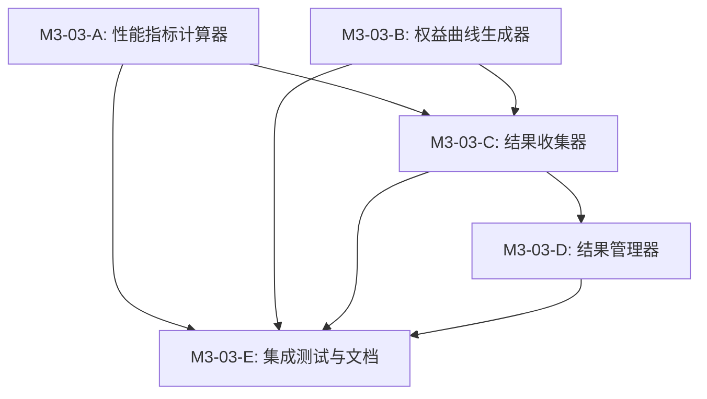

# M3-03 任务拆分：Analytics Output & API

**父任务**: M3-03 - Analytics Output & API  
**预计总工期**: 6天  
**拆分日期**: 2024-11-08  
**状态**: 📋 规划中

---

## 📋 任务概述

实现回测结果的性能指标计算、结果收集和查询接口，提供完整的回测结果分析能力。

---

## 🎯 子任务拆分

### M3-03-A: 性能指标计算器 (Performance Metrics Calculator)

**预计工期**: 2天  
**优先级**: 🔥 高  
**依赖**: M2-04 Ledger ✅  
**复杂度**: ⭐⭐⭐

#### 核心功能

1. **收益率计算**
   - 日收益率序列
   - 累计收益率
   - 年化收益率
   - 平均日收益率

2. **风险指标**
   - Sharpe Ratio (夏普比率)
   - Sortino Ratio (索提诺比率)
   - Calmar Ratio (卡尔马比率)
   - 波动率 (年化标准差)
   - 下行波动率

3. **回撤分析**
   - 最大回撤 (Maximum Drawdown)
   - 回撤起止时间
   - 回撤持续时间
   - 当前回撤
   - 回撤序列

4. **风险价值**
   - VaR (Value at Risk) 95%
   - CVaR (Conditional VaR) 95%

#### 交付物

- `performance-calculator.ts` (~400行)
- `metrics-helpers.ts` (~200行)
- `__tests__/performance-calculator.spec.ts` (~500行, 20个测试)
- 单元测试覆盖率 > 90%

#### 验收标准

- [x] 所有核心指标计算正确
- [x] 处理空数据/边界情况
- [x] big.js 精度保持
- [x] 性能：计算1000个数据点 < 100ms

---

### M3-03-B: 权益曲线生成器 (Equity Curve Generator)

**预计工期**: 1天  
**优先级**: 🔥 高  
**依赖**: M2-04 Ledger ✅  
**复杂度**: ⭐⭐

#### 核心功能

1. **权益曲线构建**
   - 从交易记录生成权益曲线
   - 时间序列对齐
   - 支持日/小时/分钟粒度

2. **回撤曲线**
   - 计算实时回撤
   - 标识回撤区间
   - 高水位线追踪

3. **数据聚合**
   - 按时间粒度聚合
   - 缺失数据填充
   - 平滑处理（可选）

#### 交付物

- `equity-curve-generator.ts` (~300行)
- `__tests__/equity-curve-generator.spec.ts` (~300行, 12个测试)

#### 验收标准

- [x] 权益曲线准确
- [x] 回撤计算正确
- [x] 支持多种时间粒度
- [x] 边界情况处理

---

### M3-03-C: 结果收集器 (Result Collector)

**预计工期**: 1.5天  
**优先级**: 🔥 高  
**依赖**: M3-03-A ✅, M3-03-B ✅, M2-04 ✅  
**复杂度**: ⭐⭐⭐

#### 核心功能

1. **数据汇总**
   - 从Ledger收集交易数据
   - 从EventStore收集日志
   - 从FeatureRegistry收集特征目录
   - 汇总配置信息

2. **性能指标集成**
   - 调用PerformanceCalculator
   - 生成权益曲线
   - 计算所有指标

3. **结果持久化**
   - 生成结果文件 (JSON)
   - 保存到指定目录
   - 文件路径管理

4. **错误处理**
   - 部分失败容错
   - 结果状态标记
   - 错误信息记录

#### 交付物

- `result-collector.ts` (~400行)
- `__tests__/result-collector.spec.ts` (~400行, 15个测试)

#### 验收标准

- [x] 完整收集所有模块数据
- [x] 性能指标计算准确
- [x] 结果文件格式正确
- [x] 部分失败不影响其他数据

---

### M3-03-D: 结果管理器 (Results Manager)

**预计工期**: 1天  
**优先级**: 🟡 中  
**依赖**: M3-03-C ✅  
**复杂度**: ⭐⭐

#### 核心功能

1. **结果存储**
   - 文件系统存储
   - 结果索引管理
   - 元数据缓存

2. **查询接口**
   - 获取会话结果
   - 列出所有会话
   - 获取性能指标
   - 获取权益曲线

3. **结果管理**
   - 删除会话结果
   - 清理过期结果
   - 存储统计信息

4. **缓存优化**
   - LRU缓存
   - 延迟加载
   - 增量更新

#### 交付物

- `results-manager.ts` (~350行)
- `results-storage.ts` (~200行)
- `__tests__/results-manager.spec.ts` (~350行, 12个测试)

#### 验收标准

- [x] 查询性能良好
- [x] 缓存命中率 > 80%
- [x] 存储空间管理
- [x] 并发访问安全

---

### M3-03-E: 集成测试与文档

**预计工期**: 0.5天  
**优先级**: 🟡 中  
**依赖**: M3-03-A ✅, M3-03-B ✅, M3-03-C ✅, M3-03-D ✅  
**复杂度**: ⭐

#### 核心功能

1. **集成测试**
   - 端到端结果收集测试
   - 多会话测试
   - 性能基准测试

2. **文档编写**
   - README.md
   - API使用指南
   - 性能指标说明
   - 使用示例

3. **示例代码**
   - 基础使用示例
   - 高级功能示例
   - 性能优化示例

#### 交付物

- `__tests__/analytics-integration.spec.ts` (~300行, 10个测试)
- `examples/basic-analytics.ts` (~200行)
- `examples/advanced-analytics.ts` (~250行)
- `README.md` (~600行)
- `METRICS-GUIDE.md` (~400行)

#### 验收标准

- [x] 集成测试通过
- [x] 文档完整清晰
- [x] 示例可运行
- [x] 性能指标说明准确

---

## 📊 工期分配

| 子任务 | 预计工期 | 实际工期 | 状态 |
|--------|----------|----------|------|
| M3-03-A: 性能指标计算器 | 2天 | - | ⏳ 待开始 |
| M3-03-B: 权益曲线生成器 | 1天 | - | ⏳ 待开始 |
| M3-03-C: 结果收集器 | 1.5天 | - | ⏳ 待开始 |
| M3-03-D: 结果管理器 | 1天 | - | ⏳ 待开始 |
| M3-03-E: 集成测试与文档 | 0.5天 | - | ⏳ 待开始 |
| **总计** | **6天** | **-** | **⏳** |

---

## 📦 代码量预估

| 类别 | 预估行数 |
|------|----------|
| 接口定义 | ~350行 |
| 实现代码 | ~1,650行 |
| 测试代码 | ~1,850行 |
| 文档 | ~1,200行 |
| 示例代码 | ~450行 |
| **总计** | **~5,500行** |

---

## 🎯 核心目标

1. **准确性** - 性能指标计算准确，符合金融行业标准
2. **完整性** - 覆盖所有必要的性能指标和风险指标
3. **性能** - 计算效率高，支持大规模数据
4. **易用性** - API清晰简洁，文档完善
5. **可扩展** - 支持自定义指标和导出格式

---

## 🔗 依赖关系

---

## ✅ 验收标准（整体）

### 功能性
- [ ] 所有性能指标计算正确
- [ ] 结果收集完整无遗漏
- [ ] 查询API功能完善
- [ ] 错误处理健全

### 质量
- [ ] 单元测试覆盖率 > 90%
- [ ] 集成测试通过
- [ ] 无TypeScript错误
- [ ] 无Linter警告

### 性能
- [ ] 性能指标计算：1000点数据 < 100ms
- [ ] 结果收集：完整会话 < 2秒
- [ ] 查询响应：< 100ms
- [ ] 内存使用：< 100MB

### 文档
- [ ] README完整
- [ ] API文档齐全
- [ ] 指标说明清晰
- [ ] 示例可运行

---

## 📝 备注

### 技术要点

1. **精度处理**
   - 所有金额计算使用 `big.js`
   - 收益率等比率使用原生 number
   - 时间戳使用 ISO 8601 字符串

2. **性能优化**
   - 权益曲线增量计算
   - 结果缓存策略
   - 延迟加载大文件

3. **错误处理**
   - 优雅降级
   - 部分失败容错
   - 详细错误信息

4. **扩展性**
   - 支持自定义指标
   - 可配置计算参数
   - 插件化架构

### 风险与挑战

1. **计算复杂度**
   - 大规模数据性能
   - 内存占用控制
   - 并发计算

2. **数据一致性**
   - 跨模块数据同步
   - 时间对齐
   - 缺失数据处理

3. **指标准确性**
   - 金融指标计算标准
   - 边界情况处理
   - 精度保持

---

**创建时间**: 2024-11-08  
**最后更新**: 2024-11-08  
**负责人**: AI Assistant

