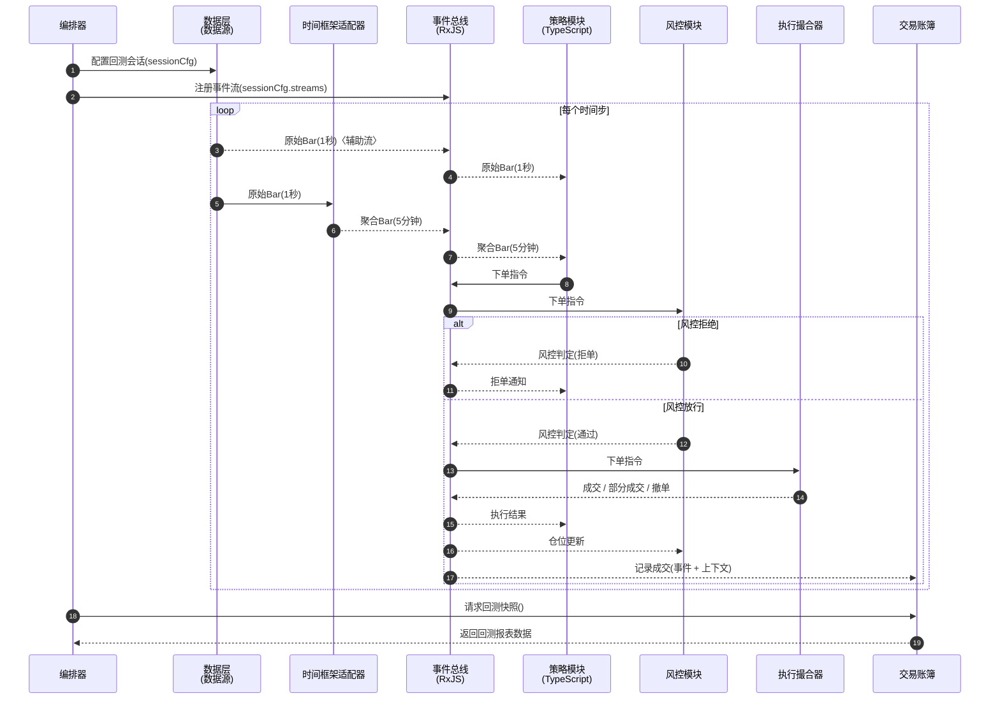
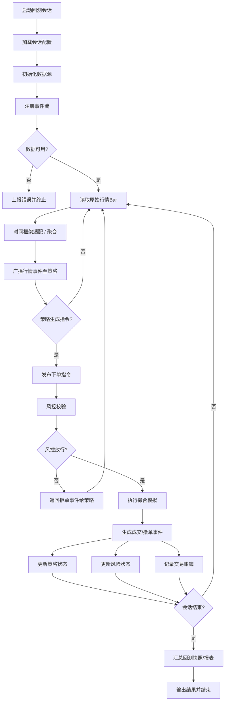

# 回测框架共识纪要

最后更新：2025-11-04

## 1. 目标与范畴
- 建立 TypeScript 回测框架，拥抱 `big.js` 保证数值精度，使用 RxJS 作为事件驱动骨架。
- 聚焦单策略回测（暂不支持策略组合），输出结构化交易账簿供“交易结果分析”功能消费。

## 2. 分层架构共识
- **数据接入层**：封装 Parquet+DuckDB 等多数据源为统一 `DataProvider`，负责时间对齐、缺口填补、特征工程。
- **时间框架适配层**：`TimeframeAdapter/Resampler` 组件，把最细粒度数据转换成策略声明的主时间框架，并可同步输出原始辅助流。
- **事件总线层**：基于 RxJS 的事件编排，实现发布/订阅、顺序推进、背压控制，为各层提供解耦通信。
- **策略层**：TypeScript 策略沙箱，订阅行情事件，运用 `big.js` 计算并生成下单/撤单指令；提供生命周期钩子与时间框架声明。
- **执行撮合层**：模拟订单簿与成交，处理滑点、手续费、内部止损止盈等逻辑，生成成交/部分成交/撤单事件。
- **风险控制层**：独立于策略运行，监控仓位、资金、杠杆及止盈止损阈值，对违规指令进行阻断或强平。
- **交易账簿与日志层**：替代原“性能分析与报告”称谓，负责记录逐笔成交、订单状态、资金曲线、策略因子与上下文信息，产出供分析模块使用的结构化数据。
- **编排与配置层**：管理回测会话生命周期、依赖注入与组件注册，对接外部前端/调度服务。

## 3. 数据粒度与多源处理
- 数据源可能来自秒级、分钟级乃至小时级行情；数据层通过统一接口输出标准化 `BarEvent`（包含时间戳、OHLCV、特征集合、`timeframe` 元数据）。
- 策略可同时声明一个主时间框架（如 5 分钟）与若干辅助流（如 1 秒），框架保证同时推送聚合事件与原始事件。
- 当源粒度高于策略需求：通过 `TimeframeAdapter` 聚合。
- 当源粒度低于策略需求：默认拒绝，提示策略选择合适粒度或另行补充细数据。

## 4. 事件驱动交互
### 4.1 时序图

### 4.2 活动图

## 5. 命名约定与下一步
- “交易账簿与日志层”沿用英文 `Trade Ledger & Replay Logs`，避免与后续分析模块混淆。
- 下一步可针对：组件接口定义、事件模型（TypeScript 类型）以及回测会话配置格式进行细化。

如需调整或扩展以上共识，请继续补充。框架方案的进一步细化将以此为基线。
