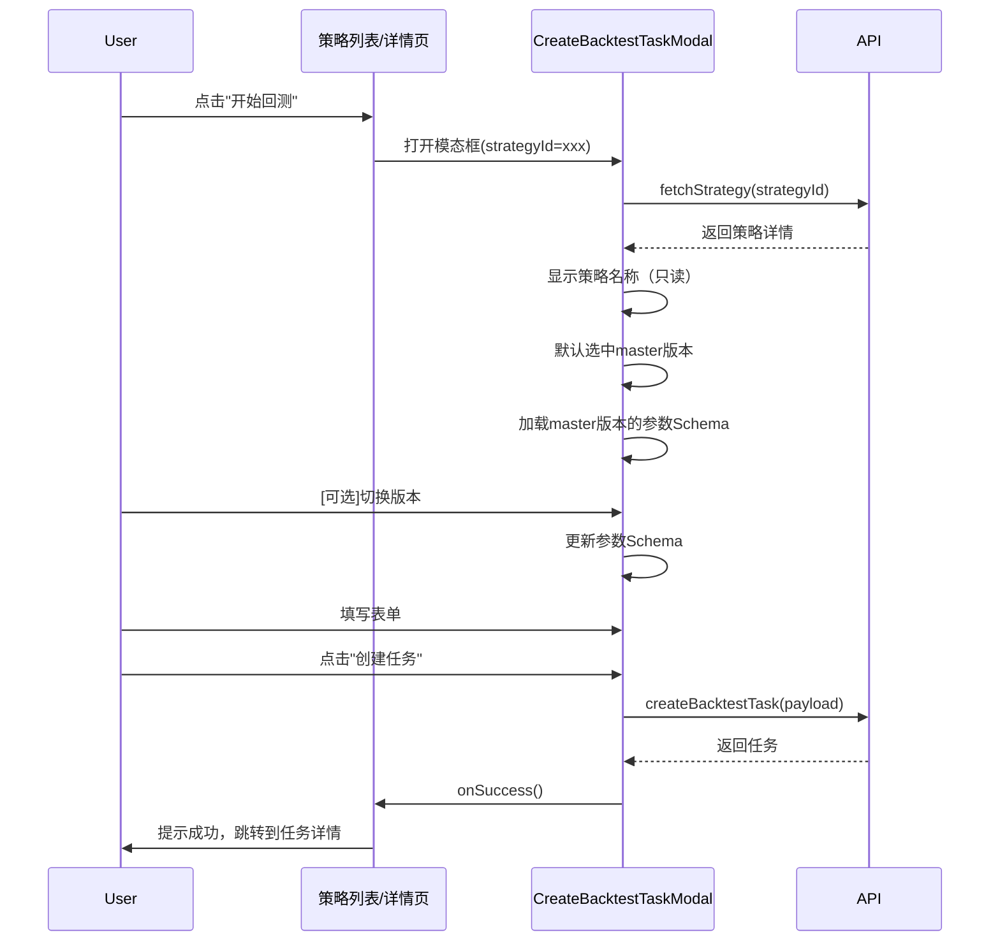
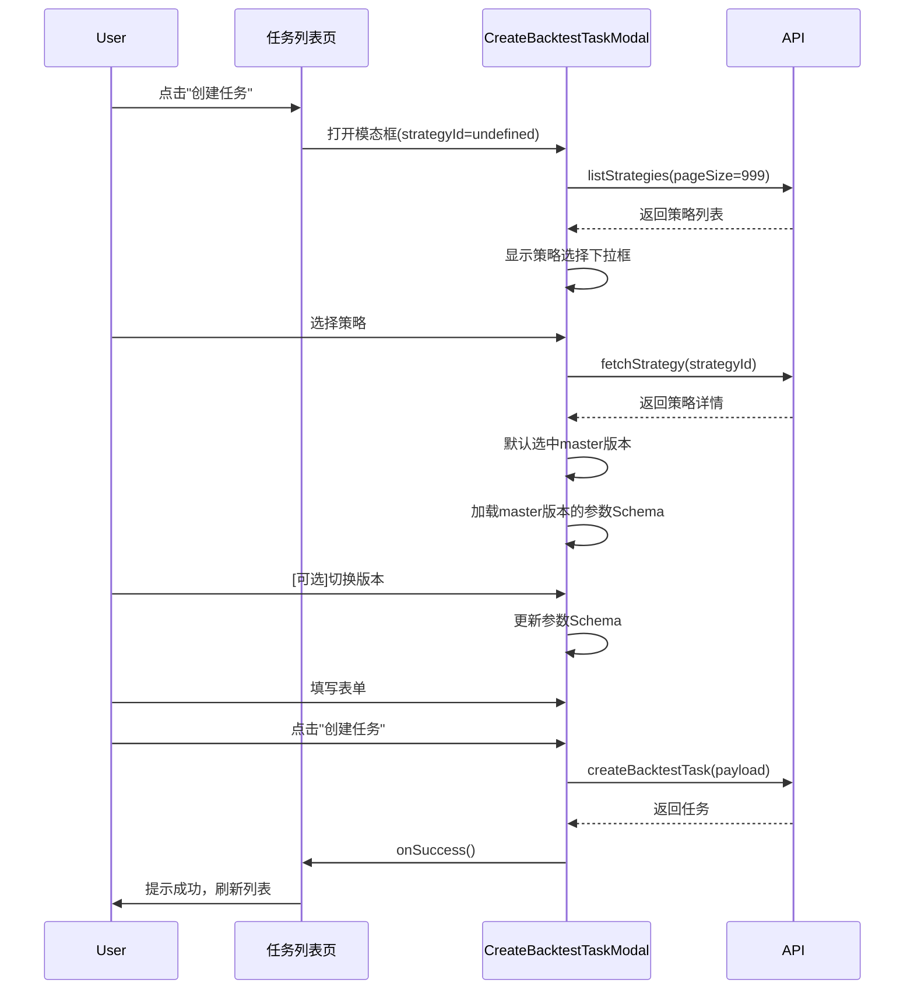

# 创建回测任务 - 交互流程设计

**最后更新**: 2025-11-13  
**版本**: v2.0

---

## 📋 目录

1. [两种创建场景](#两种创建场景)
2. [场景1：从策略列表/详情页创建](#场景1从策略列表详情页创建)
3. [场景2：从任务列表页创建](#场景2从任务列表页创建)
4. [表单字段设计](#表单字段设计)
5. [交互流程](#交互流程)
6. [数据提交](#数据提交)

---

## 🎯 两种创建场景

### 场景对比表

| 特性 | 场景1：策略已知 | 场景2：策略未知 |
|------|----------------|----------------|
| **入口** | 策略列表页"开始回测"按钮<br>策略详情页"创建任务"按钮 | 任务列表页"创建任务"按钮 |
| **策略ID** | ✅ 已知（从父组件传入） | ❌ 未知（需要用户选择） |
| **策略选择** | 🚫 不显示，只读显示策略名称 | ✅ 显示下拉框，加载所有策略 |
| **版本选择** | ✅ 下拉框，默认master | ✅ 下拉框，默认master |
| **适用场景** | 用户已在浏览某个策略，想立即测试 | 用户想测试任意策略 |

---

## 场景1：从策略列表/详情页创建

### 入口

#### 1. 策略列表页
```tsx
// 策略列表的每一行/卡片
<Button 
  icon={<RocketOutlined />}
  onClick={() => {
    setSelectedStrategyId(strategy.strategyId);
    setCreateModalOpen(true);
  }}
>
  开始回测
</Button>
```

#### 2. 策略详情页
```tsx
// 策略详情页顶部
<Button 
  type="primary"
  icon={<RocketOutlined />}
  onClick={() => setCreateModalOpen(true)}
>
  创建回测任务
</Button>
```

### 组件调用

```tsx
<CreateBacktestTaskModal
  open={createModalOpen}
  onCancel={() => setCreateModalOpen(false)}
  onSuccess={handleSuccess}
  strategyId={strategy.strategyId}  // ← 关键：传入策略ID
  datasets={datasets}
/>
```

### 表单布局

```
┌────────────────────────────────────────────┐
│ 创建回测任务                                 │
├────────────────────────────────────────────┤
│ 💡 提示：正在为策略"双均线策略"创建回测任务   │
│                                             │
│ === 基本信息 ===                            │
│ 任务名称: [双均线策略-BTC/USDT-2024-11-13]  │
│           [自动生成]                        │
│ 任务描述: [_____________________________]  │
│                                             │
│ === 策略配置 ===                            │
│ 策略名称: 双均线策略 (只读，灰色背景)        │
│ 脚本版本: [▼ v1.0 (Master)]                │ ← 可选择
│           - v1.0 (Master)                   │
│           - v1.1 - 修复bug                  │
│           - v1.2 - 优化参数                 │
│                                             │
│ === 策略参数 ===                            │
│ 快线周期: [12]                              │
│ 慢线周期: [26]                              │
│ ...                                         │
│                                             │
│ === 数据配置 ===                            │
│ ...                                         │
│                                             │
│ [取消] [创建任务]                           │
└────────────────────────────────────────────┘
```

### 交互流程



---

## 场景2：从任务列表页创建

### 入口

```tsx
// 任务列表页顶部
<Button 
  type="primary"
  size="large"
  icon={<PlusOutlined />}
  onClick={() => setCreateModalOpen(true)}
>
  创建任务
</Button>
```

### 组件调用

```tsx
<CreateBacktestTaskModal
  open={createModalOpen}
  onCancel={() => setCreateModalOpen(false)}
  onSuccess={handleSuccess}
  // strategyId 不传，组件内部会显示策略选择框
  datasets={datasets}
/>
```

### 表单布局

```
┌────────────────────────────────────────────┐
│ 创建回测任务                                 │
├────────────────────────────────────────────┤
│ 💡 提示：请选择策略并配置回测参数            │
│                                             │
│ === 基本信息 ===                            │
│ 任务名称: [_____________________________]  │
│           [自动生成]                        │
│ 任务描述: [_____________________________]  │
│                                             │
│ === 策略配置 ===                            │
│ 选择策略: [▼ 请选择策略...]                │ ← 需要选择
│           - 双均线策略                      │
│           - MACD策略                        │
│           - RSI策略                         │
│           ...                               │
│                                             │
│ 脚本版本: [▼ v1.0 (Master)]                │ ← 选择策略后可选
│           - v1.0 (Master)                   │
│           - v1.1 - 修复bug                  │
│                                             │
│ === 策略参数 ===                            │
│ 快线周期: [12]                              │
│ 慢线周期: [26]                              │
│ ...                                         │
│                                             │
│ === 数据配置 ===                            │
│ ...                                         │
│                                             │
│ [取消] [创建任务]                           │
└────────────────────────────────────────────┘
```

### 交互流程



---

## 表单字段设计

### 基本信息

| 字段名 | 类型 | 必填 | 默认值 | 说明 |
|--------|------|------|--------|------|
| taskName | string | ✅ | 自动生成 | 任务名称，最多100字符 |
| taskDescription | string | ❌ | - | 任务描述，最多500字符 |

**自动生成规则**:
```
{策略名称}-{数据集名称}-{日期}
例如: 双均线策略-BTC/USDT-2024-11-13
```

### 策略配置

#### 场景1（策略已知）

| 字段名 | 类型 | 展示方式 | 说明 |
|--------|------|----------|------|
| 策略名称 | string | 只读输入框（disabled） | 灰色背景，不可编辑 |
| scriptVersionId | string | 下拉选择框 | 默认选中master，可切换 |

#### 场景2（策略未知）

| 字段名 | 类型 | 展示方式 | 说明 |
|--------|------|----------|------|
| strategyId | string | 下拉选择框（搜索） | 必填，显示所有策略 |
| scriptVersionId | string | 下拉选择框 | 选择策略后启用，默认master |

**版本显示格式**:
```tsx
{versionName} {isMaster ? '[Master]' : ''} {remark ? `- ${remark}` : ''}

示例:
- v1.0 [Master]
- v1.1 - 修复bug
- v1.2 - 优化参数
```

### 策略参数（动态）

根据所选脚本版本的 `parameterSchema` 动态渲染，支持：
- text 输入框
- number 数字输入
- switch 布尔开关
- select 下拉选择

### 数据配置

| 字段名 | 类型 | 必填 | 默认值 | 说明 |
|--------|------|------|--------|------|
| datasetId | number | ✅ | - | 数据集ID，下拉选择（可搜索） |
| dataConfig.timeRange | [Date, Date] | ✅ | 数据集时间范围 | 限制在数据集范围内 |
| dataConfig.timeframe | string | ✅ | 数据集granularity | 交易周期（1m/5m/15m/30m/1h/4h/1d） |

### 执行配置

| 字段名 | 类型 | 必填 | 默认值 | 说明 |
|--------|------|------|--------|------|
| executionConfig.initialCapital | number | ✅ | 10000 | 初始资金，1-10,000,000 USD |
| executionConfig.fees.makerFee | number | ✅ | 0.0002 | Maker手续费率，0-1% |
| executionConfig.fees.takerFee | number | ✅ | 0.0005 | Taker手续费率，0-1% |
| executionConfig.leverage | number | ❌ | 1 | 杠杆倍数（MVP暂不支持，禁用） |
| executionConfig.slippage | number | ❌ | 0 | 滑点（MVP暂不支持，禁用） |
| executionConfig.tradingHours | object | ❌ | - | 交易时段（高级配置，可选） |

---

## 交互流程

### 状态管理

```typescript
// 组件内部状态
const [loadingStrategies, setLoadingStrategies] = useState(false);
const [strategies, setStrategies] = useState<StrategySummary[]>([]);
const [strategy, setStrategy] = useState<StrategyDetail | null>(null);
const [selectedStrategyId, setSelectedStrategyId] = useState<string | undefined>(propsStrategyId);
const [selectedDataset, setSelectedDataset] = useState<any>(null);
const [parameterSchema, setParameterSchema] = useState<ParamSchema[]>([]);

// 场景判断
const isScenario1 = !!propsStrategyId; // 策略已知
const isScenario2 = !propsStrategyId; // 需要选择策略
```

### 关键交互

#### 1. 场景2加载策略列表

```typescript
useEffect(() => {
  if (open && isScenario2) {
    setLoadingStrategies(true);
    listStrategies({ pageSize: 999 })
      .then((response) => setStrategies(response.items))
      .catch((err) => message.error('加载策略列表失败: ' + err.message))
      .finally(() => setLoadingStrategies(false));
  }
}, [open, isScenario2]);
```

#### 2. 加载策略详情

```typescript
useEffect(() => {
  if (open && selectedStrategyId) {
    fetchStrategy(selectedStrategyId)
      .then((data) => {
        setStrategy(data);
        // 默认选中master版本
        const masterVersion = data.masterVersion || data.latestVersion;
        if (masterVersion) {
          form.setFieldsValue({ scriptVersionId: masterVersion.scriptVersionId });
          if (masterVersion.parameterSchema) {
            setParameterSchema(masterVersion.parameterSchema as ParamSchema[]);
          }
        }
      })
      .catch((err) => message.error('加载策略详情失败: ' + err.message));
  }
}, [open, selectedStrategyId]);
```

#### 3. 策略选择变化（场景2）

```typescript
const handleStrategyChange = (strategyId: string) => {
  setSelectedStrategyId(strategyId);
  // 清空版本和参数
  form.setFieldsValue({
    scriptVersionId: undefined,
    strategyParams: {},
  });
  setParameterSchema([]);
};
```

#### 4. 版本切换

```typescript
const handleVersionChange = (versionId: string) => {
  const version = strategy?.scriptVersions.find(v => v.scriptVersionId === versionId);
  if (version?.parameterSchema) {
    setParameterSchema(version.parameterSchema as ParamSchema[]);
    form.setFieldsValue({ strategyParams: {} }); // 清空之前的参数
  }
};
```

#### 5. 数据集选择

```typescript
const handleDatasetChange = (datasetId: number) => {
  const dataset = datasets.find(d => d.datasetId === datasetId);
  if (dataset) {
    setSelectedDataset(dataset);
    // 自动填充时间范围和周期
    form.setFieldsValue({
      dataConfig: {
        timeRange: [dayjs(dataset.timeStart), dayjs(dataset.timeEnd)],
        timeframe: dataset.granularity,
      },
    });
  }
};
```

---

## 数据提交

### 提交数据结构

```typescript
interface CreateBacktestTaskRequest {
  taskName: string;
  taskDescription?: string;
  strategyId: string;              // 场景1：props传入，场景2：用户选择
  scriptVersionId: string;         // 用户选择的版本
  datasetId: number;               // 用户选择的数据集
  strategyParams: Record<string, any>;  // 动态参数
  executionConfig: {
    initialCapital: number;
    leverage: number;
    slippage: number;
    fees: {
      makerFee: number;
      takerFee: number;
    };
    tradingHours?: {
      start: string;  // HH:mm
      end: string;    // HH:mm
    };
  };
  dataConfig: {
    timeRange: {
      start: string;  // ISO 8601
      end: string;    // ISO 8601
    };
    timeframe: string;
  };
}
```

### 提交流程

```typescript
const handleSubmit = async (values: any) => {
  try {
    setLoading(true);
    
    const payload: CreateBacktestTaskRequest = {
      taskName: values.taskName,
      taskDescription: values.taskDescription,
      strategyId: selectedStrategyId!,  // 关键：使用 selectedStrategyId
      scriptVersionId: values.scriptVersionId,
      datasetId: values.datasetId,
      strategyParams: values.strategyParams || {},
      executionConfig: {
        initialCapital: values.executionConfig.initialCapital,
        leverage: values.executionConfig.leverage || 1,
        slippage: values.executionConfig.slippage || 0,
        fees: {
          makerFee: values.executionConfig.fees.makerFee,
          takerFee: values.executionConfig.fees.takerFee,
        },
        tradingHours: values.executionConfig.tradingHours,
      },
      dataConfig: {
        timeRange: {
          start: values.dataConfig.timeRange[0].toISOString(),
          end: values.dataConfig.timeRange[1].toISOString(),
        },
        timeframe: values.dataConfig.timeframe,
      },
    };

    await createBacktestTask(payload);
    message.success('回测任务创建成功！');
    form.resetFields();
    setParameterSchema([]);
    onSuccess();
  } catch (error: any) {
    message.error('创建任务失败: ' + (error.message || '未知错误'));
  } finally {
    setLoading(false);
  }
};
```

### 成功后行为

#### 场景1（从策略页创建）
```typescript
const handleSuccess = () => {
  setCreateModalOpen(false);
  message.success('任务已创建，正在跳转...');
  // 跳转到任务详情页
  navigate(`/backtesting/tasks/${newTaskId}`);
};
```

#### 场景2（从任务列表页创建）
```typescript
const handleSuccess = () => {
  setCreateModalOpen(false);
  setPage(1);
  loadTasks(); // 刷新任务列表
};
```

---

## 验证规则

### 字段验证

| 字段 | 验证规则 |
|------|----------|
| taskName | 必填，最大长度100 |
| taskDescription | 非必填，最大长度500 |
| strategyId (场景2) | 必填 |
| scriptVersionId | 必填 |
| datasetId | 必填 |
| timeRange | 必填，必须在数据集范围内 |
| timeframe | 必填 |
| initialCapital | 必填，数字，范围1-10,000,000 |
| makerFee | 必填，数字，范围0-0.01 |
| takerFee | 必填，数字，范围0-0.01 |

### 自定义验证

```typescript
// 时间范围验证
<RangePicker
  disabledDate={(current) => {
    if (!selectedDataset) return false;
    return current && (
      current < dayjs(selectedDataset.timeStart) ||
      current > dayjs(selectedDataset.timeEnd)
    );
  }}
/>
```

---

## 错误处理

### API错误

| 错误场景 | 错误提示 | 处理方式 |
|----------|---------|----------|
| 策略列表加载失败 | "加载策略列表失败: {错误信息}" | 显示message，允许重试 |
| 策略详情加载失败 | "加载策略详情失败: {错误信息}" | 显示message，禁用表单 |
| 任务创建失败 | "创建任务失败: {错误信息}" | 显示message，保留表单数据 |

### 网络超时

```typescript
// API client配置
const client = axios.create({
  baseURL: 'http://localhost:3000/api/v1/backtesting/tasks',
  timeout: 30000, // 30秒超时
});
```

---

## UI/UX细节

### 加载状态

1. **策略列表加载**（场景2）
   ```tsx
   <Select
     placeholder="请选择策略"
     loading={loadingStrategies}  // ← 加载时显示loading
     disabled={loadingStrategies}
   />
   ```

2. **策略详情加载**
   - 版本选择框禁用，直到策略详情加载完成
   - 参数区域显示 "加载中..." 或骨架屏

3. **提交中**
   ```tsx
   <Modal
     confirmLoading={loading}  // ← 提交时禁用按钮
   />
   ```

### 反馈提示

1. **成功提示**
   - message.success('回测任务创建成功！')
   - 自动关闭模态框
   - 刷新列表或跳转详情页

2. **错误提示**
   - message.error() 显示具体错误信息
   - 保留用户已填写的数据
   - 允许用户修改后重试

3. **警告提示**
   - 数据集信息Alert（选择后显示）
   - 参数范围提示（Tooltip）
   - 高级配置折叠（Collapse）

### 友好体验

1. **自动填充**
   - 任务名称：提供"自动生成"链接
   - 时间范围：选择数据集后自动填充
   - 交易周期：默认使用数据集的粒度

2. **智能提示**
   - Tooltip解释每个字段
   - Alert提示数据集信息
   - Placeholder给出示例格式

3. **响应式**
   - Modal width: 900px（大屏）
   - 表单布局：vertical（易于阅读）
   - 字段分组：使用Divider分隔

---

## 技术实现

### 组件Props类型

```typescript
interface CreateBacktestTaskModalProps {
  open: boolean;
  onCancel: () => void;
  onSuccess: () => void;
  strategyId?: string;  // 可选，区分两种场景
  datasets?: Array<{
    datasetId: number;
    name: string;
    tradingPair: string;
    granularity: string;
    timeStart: string;
    timeEnd: string;
    rowCount: number;
  }>;
}
```

### 关键Hooks

```typescript
// 场景判断
const isScenario1 = !!propsStrategyId;
const isScenario2 = !propsStrategyId;

// 状态管理
const [selectedStrategyId, setSelectedStrategyId] = useState<string | undefined>(propsStrategyId);

// 场景2：加载策略列表
useEffect(() => {
  if (open && isScenario2) {
    // 加载策略列表
  }
}, [open, isScenario2]);

// 加载策略详情（两种场景都需要）
useEffect(() => {
  if (open && selectedStrategyId) {
    // 加载策略详情
  }
}, [open, selectedStrategyId]);
```

---

## 总结

### 关键改进点

1. ✅ **支持两种场景**：策略已知 vs 策略未知
2. ✅ **智能默认值**：master版本、数据集时间、交易周期
3. ✅ **动态参数**：根据版本Schema自动渲染
4. ✅ **友好体验**：自动填充、智能提示、加载反馈
5. ✅ **完善验证**：必填检查、范围限制、格式验证

### 下一步优化（可选）

- [ ] 支持表单草稿保存（localStorage）
- [ ] 支持从历史任务复制配置
- [ ] 支持批量创建任务
- [ ] 支持任务模板功能
- [ ] 支持参数预设管理

---

**文档维护**: Development Team  
**最后更新**: 2025-11-13

