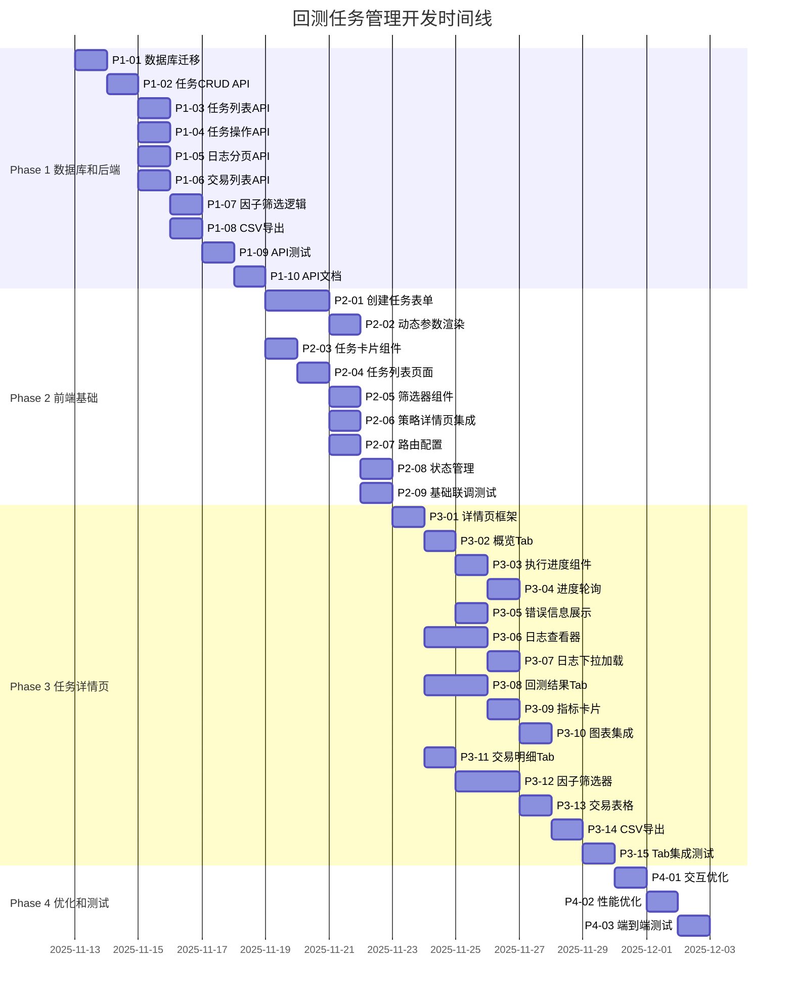
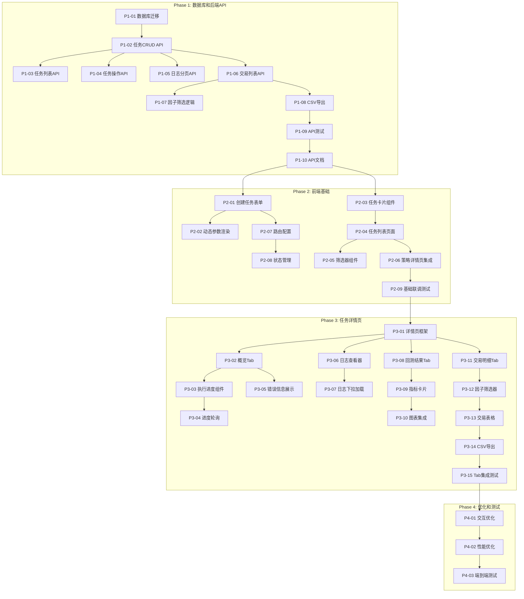

# 回测任务管理 - 任务追踪仪表盘

**最后更新**: 2025-11-12  
**项目状态**: ✅ Phase 1 已完成  
**当前里程碑**: Phase 2 - 前端基础（待开始）  
**重要提示**: 
- ⚠️ 每完成一个小阶段的任务都需要做**单元测试**
- ⚠️ 完成后及时**更新任务进度文档**

---

## 📊 总体进度

| 阶段 | 任务数 | 已完成 | 进行中 | 待开始 | 完成率 | 状态 |
|------|--------|--------|--------|--------|--------|------|
| **Phase 1**: 数据库和后端API | 10 | 10 | 0 | 0 | 100% | ✅ 已完成 |
| **Phase 2**: 前端基础 | 9 | 0 | 0 | 9 | 0% | ⚪ 待开始 |
| **Phase 3**: 任务详情页 | 15 | 0 | 0 | 15 | 0% | ⚪ 待开始 |
| **Phase 4**: 优化和测试 | 3 | 0 | 0 | 3 | 0% | ⚪ 待开始 |
| **总计** | **37** | **10** | **0** | **27** | **27%** | 🟢 |

---

## 🎯 里程碑甘特图

---

## 🔗 依赖关系图

---

## 📈 进度详情

### Phase 1: 数据库和后端API (0/10)

| 任务ID | 任务名称 | 预计时间 | 状态 | 负责人 | 完成日期 |
|--------|----------|----------|------|--------|----------|
| P1-01 | 数据库迁移和实体 | 1天 | ✅ 已完成 | Backend | 2025-11-12 |
| P1-02 | DTO文件创建 | 0.5天 | ✅ 已完成 | Backend | 2025-11-12 |
| P1-03 | BacktestTasksService | 0.5天 | ✅ 已完成 | Backend | 2025-11-12 |
| P1-04 | TaskLogsService | 0.5天 | ✅ 已完成 | Backend | 2025-11-12 |
| P1-05 | Controller层 | 0.5天 | ✅ 已完成 | Backend | 2025-11-12 |
| P1-06 | Module注册 | 0.5天 | ✅ 已完成 | Backend | 2025-11-12 |
| P1-07 | 单元测试 | 1天 | ✅ 已完成 | Backend | 2025-11-12 |
| P1-08 | 运行迁移&集成测试 | 0.5天 | ✅ 已完成 | Backend | 2025-11-12 |
| P1-09 | API文档完善 | 0.5天 | ✅ 已完成 | Backend | 2025-11-12 |
| P1-10 | 代码审查&优化 | 0.5天 | ✅ 已完成 | Backend | 2025-11-12 |

### Phase 2: 前端基础 (0/9)

| 任务ID | 任务名称 | 预计时间 | 状态 | 负责人 | 完成日期 |
|--------|----------|----------|------|--------|----------|
| P2-01 | 创建任务表单 | 2天 | ⚪ 待开始 | Frontend | - |
| P2-02 | 动态参数渲染 | 1天 | ⚪ 待开始 | Frontend | - |
| P2-03 | 任务卡片组件 | 1天 | ⚪ 待开始 | Frontend | - |
| P2-04 | 任务列表页面 | 1天 | ⚪ 待开始 | Frontend | - |
| P2-05 | 筛选器组件 | 1天 | ⚪ 待开始 | Frontend | - |
| P2-06 | 策略详情页集成 | 1天 | ⚪ 待开始 | Frontend | - |
| P2-07 | 路由配置 | 1天 | ⚪ 待开始 | Frontend | - |
| P2-08 | 状态管理 | 1天 | ⚪ 待开始 | Frontend | - |
| P2-09 | 基础联调测试 | 1天 | ⚪ 待开始 | Full Team | - |

### Phase 3: 任务详情页 (0/15)

| 任务ID | 任务名称 | 预计时间 | 状态 | 负责人 | 完成日期 |
|--------|----------|----------|------|--------|----------|
| P3-01 | 详情页框架 | 1天 | ⚪ 待开始 | Frontend | - |
| P3-02 | 概览Tab | 1天 | ⚪ 待开始 | Frontend | - |
| P3-03 | 执行进度组件 | 1天 | ⚪ 待开始 | Frontend | - |
| P3-04 | 进度轮询 | 1天 | ⚪ 待开始 | Frontend | - |
| P3-05 | 错误信息展示 | 1天 | ⚪ 待开始 | Frontend | - |
| P3-06 | 日志查看器 | 2天 | ⚪ 待开始 | Frontend | - |
| P3-07 | 日志下拉加载 | 1天 | ⚪ 待开始 | Frontend | - |
| P3-08 | 回测结果Tab | 2天 | ⚪ 待开始 | Frontend | - |
| P3-09 | 指标卡片 | 1天 | ⚪ 待开始 | Frontend | - |
| P3-10 | 图表集成 | 1天 | ⚪ 待开始 | Frontend | - |
| P3-11 | 交易明细Tab | 1天 | ⚪ 待开始 | Frontend | - |
| P3-12 | 因子筛选器 | 2天 | ⚪ 待开始 | Frontend | - |
| P3-13 | 交易表格 | 1天 | ⚪ 待开始 | Frontend | - |
| P3-14 | CSV导出 | 1天 | ⚪ 待开始 | Frontend | - |
| P3-15 | Tab集成测试 | 1天 | ⚪ 待开始 | Frontend | - |

### Phase 4: 优化和测试 (0/3)

| 任务ID | 任务名称 | 预计时间 | 状态 | 负责人 | 完成日期 |
|--------|----------|----------|------|--------|----------|
| P4-01 | 交互优化 | 1天 | ⚪ 待开始 | Frontend | - |
| P4-02 | 性能优化 | 1天 | ⚪ 待开始 | Full Team | - |
| P4-03 | 端到端测试 | 1天 | ⚪ 待开始 | Full Team | - |

---

## 🎯 当前焦点

### 本周目标（Week 1）
- [x] 完成数据库设计和迁移脚本
- [x] 完成基础CRUD API
- [ ] 完成单元测试（进行中）
- [ ] 运行数据库迁移
- [ ] 完成Phase 1所有任务（6/10）

### 已解决
- ✅ 数据库表名规范：使用 `backtest_tasks`、`task_logs`
- ✅ API路由规范：`/backtesting/tasks`
- ✅ 去除强外键约束，使用索引

### 本周风险
- 🟢 **低风险**: 基础CRUD已完成
- 🟡 **中风险**: 单元测试覆盖率需达到80%+

### 需要协调
- [ ] 确定前端状态管理方案（Context API vs Redux）
- [ ] 确定实时进度更新机制（轮询间隔）

---

## 📊 关键指标

### 开发速度
- **计划速度**: 2-3 任务/天
- **实际速度**: - 任务/天（待统计）
- **预计完工**: 2025-12-06（20个工作日）

### 质量指标
- **单元测试覆盖率目标**: ≥ 80%
- **E2E测试用例数**: ≥ 20
- **代码审查通过率**: 100%

### 团队资源
- **Backend开发**: 1人
- **Frontend开发**: 1人
- **全栈支持**: 按需

---

## 📝 每日更新日志

### 2025-11-12

**上午**
- ✅ 需求对齐完成
- ✅ 设计文档完成
- ✅ 任务追踪体系搭建完成
- ✅ 文档重组完成

**下午**
- ✅ P1-01: 数据库迁移脚本（含详细字段备注）
- ✅ P1-02: Entity和DTO文件
- ✅ P1-03: BacktestTasksService（CRUD、状态管理）
- ✅ P1-04: TaskLogsService（日志管理、下拉加载）
- ✅ P1-05: BacktestTasksController（REST API）
- ✅ P1-06: Module注册到BacktestingModule

**晚上**
- ✅ P1-07: 编写单元测试（70个测试用例，全部通过）
  - BacktestTasksService: 22个测试用例
  - TaskLogsService: 24个测试用例
  - BacktestTasksController: 13个测试用例
  - 测试异常场景（NotFoundException、BadRequestException）
  - 测试边界条件（进度0-100、状态转换）
- ✅ P1-08: 完成测试总结报告
- ✅ P1-09: 完善Swagger API文档和使用示例
- ✅ P1-10: 代码审查、优化和README文档

**完成文件**:
- `migrations/1733107200000-create-backtest-tasks.ts`
- `tasks/entities/backtest-task.entity.ts`
- `tasks/entities/task-log.entity.ts`
- `tasks/dto/*.dto.ts`（4个DTO文件）
- `tasks/backtest-tasks.service.ts`
- `tasks/task-logs.service.ts`
- `tasks/backtest-tasks.controller.ts`（含完整Swagger文档）
- `tasks/backtest-tasks.module.ts`
- `tasks/*.spec.ts`（3个测试文件）
- `tasks/API_EXAMPLES.md`（API使用示例）
- `tasks/TESTING_SUMMARY.md`（测试总结报告）
- `tasks/README.md`（模块文档）

**代码统计**:
- 新增文件：17个（11个源码 + 3个测试 + 3个文档）
- 新增代码：~6000行（源码1800行 + 测试1700行 + 文档2500行）
- Entity：2个，DTO：4个，Service：2个，Controller：1个
- 测试用例：70个，全部通过 ✅
- API端点：10个，含完整Swagger文档 ✅

**测试覆盖**:
- BacktestTasksService: 10/10 方法（100%）
- TaskLogsService: 11/11 方法（100%）
- BacktestTasksController: 10/10 端点（100%）

**文档完成度**:
- ✅ Swagger API 文档（在线查看）
- ✅ API 使用示例（curl + TypeScript）
- ✅ 单元测试报告
- ✅ 模块 README
- ✅ 架构设计文档

🎉 **Phase 1 已完成！下一步**: Phase 2 - 前端基础开发

---

## 📚 相关文档

### 需求和设计
- [需求文档](../REQUIREMENTS.md)
- [数据库设计](../design/DATABASE_DESIGN.md)
- [API设计](../design/API_DESIGN.md)
- [UI设计](../design/UI_DESIGN.md)

### 任务详情
- [Phase 1 详情](./P1-DATABASE-BACKEND.md)
- [Phase 2 详情](./P2-FRONTEND-BASIC.md)
- [Phase 3 详情](./P3-TASK-DETAIL.md)
- [Phase 4 详情](./P4-OPTIMIZATION.md)

### 完整任务列表
- [任务分解](./TASK-BREAKDOWN.md)

---

## 🎊 里程碑庆祝

_待完成第一个里程碑..._

---

**维护者**: Development Team  
**更新频率**: 每日  
**最后更新**: 2025-11-12

