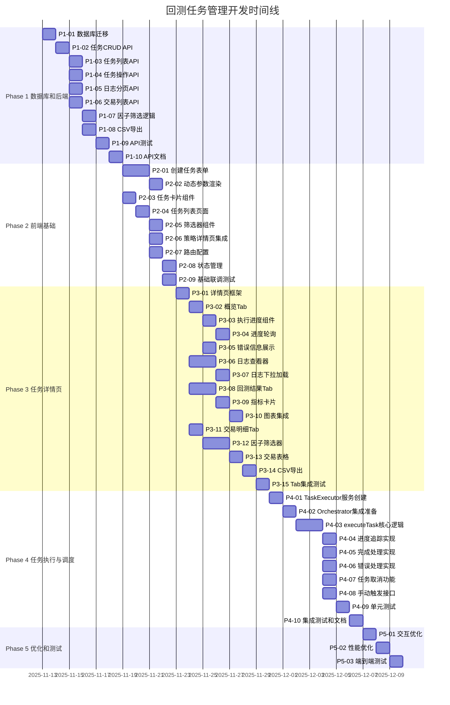
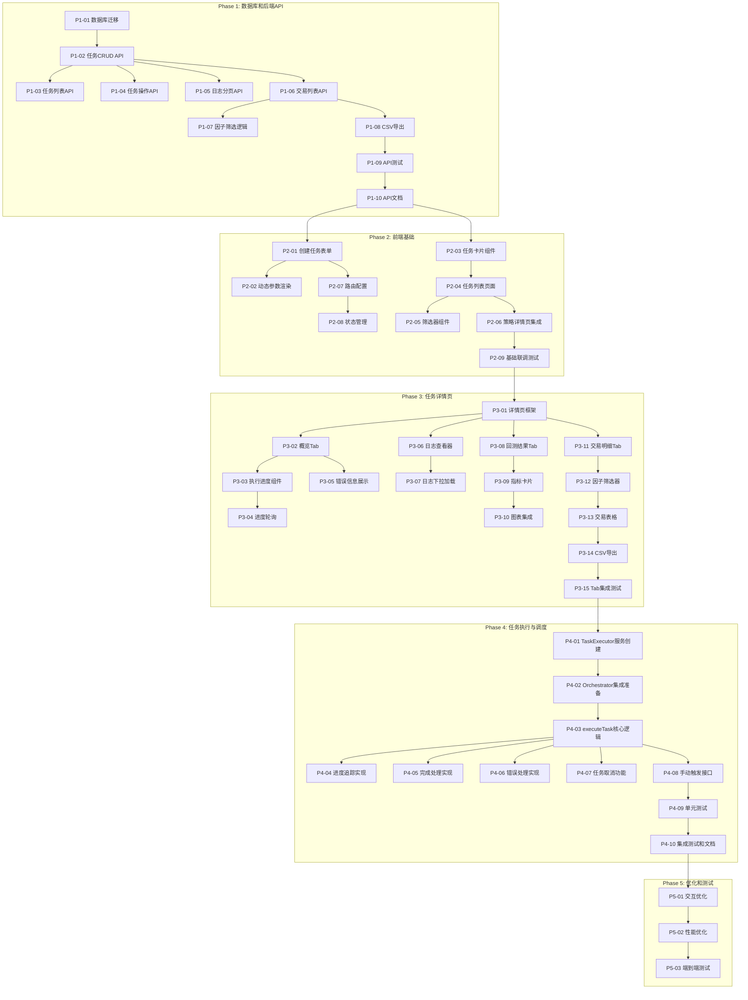

# 回测任务管理 - 任务追踪仪表盘

**最后更新**: 2025-11-13  
**项目状态**: ✅ Phase 1 已完成、✅ Phase 2 核心已完成  
**当前里程碑**: Phase 3 - 任务详情页（进行中）  
**重要提示**: 
- ⚠️ 每完成一个小阶段的任务都需要做**单元测试**
- ⚠️ 完成后及时**更新任务进度文档**

---

## 📊 总体进度

| 阶段 | 任务数 | 已完成 | 进行中 | 待开始 | 完成率 | 状态 |
|------|--------|--------|--------|--------|--------|------|
| **Phase 1**: 数据库和后端API | 10 | 10 | 0 | 0 | 100% | ✅ 已完成 |
| **Phase 2**: 前端基础 | 9 | 7 | 0 | 2 | 78% | ✅ 核心完成 |
| **Phase 3**: 任务详情页 | 15 | 10 | 0 | 5 | 67% | 🔵 进行中 |
| **Phase 4**: 任务执行与调度 | 10 | 0 | 0 | 10 | 0% | ⚪ 待开始 |
| **Phase 5**: 优化和测试 | 3 | 0 | 0 | 3 | 0% | ⚪ 待开始 |
| **总计** | **47** | **27** | **0** | **20** | **57%** | 🟢 |

---

## 🎯 里程碑甘特图

---

## 🔗 依赖关系图

---

## 📈 进度详情

### Phase 1: 数据库和后端API (0/10)

| 任务ID | 任务名称 | 预计时间 | 状态 | 负责人 | 完成日期 |
|--------|----------|----------|------|--------|----------|
| P1-01 | 数据库迁移和实体 | 1天 | ✅ 已完成 | Backend | 2025-11-12 |
| P1-02 | DTO文件创建 | 0.5天 | ✅ 已完成 | Backend | 2025-11-12 |
| P1-03 | BacktestTasksService | 0.5天 | ✅ 已完成 | Backend | 2025-11-12 |
| P1-04 | TaskLogsService | 0.5天 | ✅ 已完成 | Backend | 2025-11-12 |
| P1-05 | Controller层 | 0.5天 | ✅ 已完成 | Backend | 2025-11-12 |
| P1-06 | Module注册 | 0.5天 | ✅ 已完成 | Backend | 2025-11-12 |
| P1-07 | 单元测试 | 1天 | ✅ 已完成 | Backend | 2025-11-12 |
| P1-08 | 运行迁移&集成测试 | 0.5天 | ✅ 已完成 | Backend | 2025-11-12 |
| P1-09 | API文档完善 | 0.5天 | ✅ 已完成 | Backend | 2025-11-12 |
| P1-10 | 代码审查&优化 | 0.5天 | ✅ 已完成 | Backend | 2025-11-12 |

### Phase 2: 前端基础 (7/9)

| 任务ID | 任务名称 | 预计时间 | 状态 | 负责人 | 完成日期 |
|--------|----------|----------|------|--------|----------|
| P2-01 | API Service层 | 1天 | ✅ 已完成 | Frontend | 2025-11-12 |
| P2-02 | 动态参数表单组件 | 1天 | ✅ 已完成 | Frontend | 2025-11-12 |
| P2-03 | 创建任务Modal | 2天 | ✅ 已完成 | Frontend | 2025-11-12 |
| P2-04 | 任务卡片组件 | 0.5天 | ✅ 已完成 | Frontend | 2025-11-12 |
| P2-05 | 任务列表页面 | 1天 | ✅ 已完成 | Frontend | 2025-11-12 |
| P2-06 | 策略页集成 | 1天 | ✅ 已完成 | Frontend | 2025-11-12 |
| P2-07 | 路由配置 | 0.5天 | ✅ 已完成 | Frontend | 2025-11-12 |
| P2-08 | Bug修复&优化 | 1天 | ⚪ 待开始 | Frontend | - |
| P2-09 | 基础联调测试 | 1天 | ⚪ 待开始 | Full Team | - |

### Phase 3: 任务详情页 (2/15)

| 任务ID | 任务名称 | 预计时间 | 状态 | 负责人 | 完成日期 |
|--------|----------|----------|------|--------|----------|
| P3-01 | 详情页框架 | 1天 | ✅ 已完成 | Frontend | 2025-11-13 |
| P3-02 | 概览Tab | 1天 | ✅ 已完成 | Frontend | 2025-11-13 |
| P3-03 | 执行进度组件 | 1天 | ✅ 已完成 | Frontend | 2025-11-13 |
| P3-04 | 进度轮询 | 1天 | ✅ 已完成 | Frontend | 2025-11-13 |
| P3-05 | 错误信息展示 | 1天 | ✅ 已完成 | Frontend | 2025-11-13 |
| P3-06 | 日志查看器 | 2天 | ✅ 已完成 | Frontend | 2025-11-13 |
| P3-07 | 日志下拉加载 | 1天 | ✅ 已实现 | Frontend | 2025-11-13 |
| P3-08 | 回测结果Tab | 2天 | ✅ 已完成 | Frontend | 2025-11-13 |
| P3-09 | 指标卡片 | 1天 | ✅ 已完成 | Frontend | 2025-11-13 |
| P3-10 | 图表集成 | 1天 | ✅ 已完成 | Frontend | 2025-11-13 |
| P3-11 | 交易明细Tab | 1天 | ✅ 已完成 | Frontend | 2025-11-13 |
| P3-12 | 因子筛选器 | 2天 | ⚪ 待开始 | Frontend | - |
| P3-13 | 交易表格 | 1天 | ⚪ 待开始 | Frontend | - |
| P3-14 | CSV导出 | 1天 | ⚪ 待开始 | Frontend | - |
| P3-15 | Tab集成测试 | 1天 | ⚪ 待开始 | Frontend | - |

### Phase 4: 任务执行与调度 (0/10) 🔴 核心功能

| 任务ID | 任务名称 | 预计时间 | 状态 | 负责人 | 完成日期 |
|--------|----------|----------|------|--------|----------|
| P4-01 | TaskExecutor服务创建 | 0.5天 | ⚪ 待开始 | Backend | - |
| P4-02 | Orchestrator集成准备 | 0.5天 | ⚪ 待开始 | Backend | - |
| P4-03 | executeTask核心逻辑 | 2天 | ⚪ 待开始 | Backend | - |
| P4-04 | 进度追踪实现 | 0.5天 | ⚪ 待开始 | Backend | - |
| P4-05 | 完成处理实现 | 1天 | ⚪ 待开始 | Backend | - |
| P4-06 | 错误处理实现 | 0.5天 | ⚪ 待开始 | Backend | - |
| P4-07 | 任务取消功能 | 0.5天 | ⚪ 待开始 | Backend | - |
| P4-08 | 手动触发接口 | 0.5天 | ⚪ 待开始 | Backend | - |
| P4-09 | 单元测试 | 1天 | ⚪ 待开始 | Backend | - |
| P4-10 | 集成测试和文档 | 1天 | ⚪ 待开始 | Backend | - |

### Phase 5: 优化和测试 (0/3)

| 任务ID | 任务名称 | 预计时间 | 状态 | 负责人 | 完成日期 |
|--------|----------|----------|------|--------|----------|
| P5-01 | 交互优化 | 1天 | ⚪ 待开始 | Frontend | - |
| P5-02 | 性能优化 | 1天 | ⚪ 待开始 | Full Team | - |
| P5-03 | 端到端测试 | 1天 | ⚪ 待开始 | Full Team | - |

---

## 🎯 当前焦点

### 本周目标（Week 1）
- [x] 完成数据库设计和迁移脚本
- [x] 完成基础CRUD API
- [ ] 完成单元测试（进行中）
- [ ] 运行数据库迁移
- [ ] 完成Phase 1所有任务（6/10）

### 已解决
- ✅ 数据库表名规范：使用 `backtest_tasks`、`task_logs`
- ✅ API路由规范：`/backtesting/tasks`
- ✅ 去除强外键约束，使用索引

### 本周风险
- 🟢 **低风险**: 基础CRUD已完成
- 🟡 **中风险**: 单元测试覆盖率需达到80%+

### 需要协调
- [ ] 确定前端状态管理方案（Context API vs Redux）
- [ ] 确定实时进度更新机制（轮询间隔）

---

## 📊 关键指标

### 开发速度
- **计划速度**: 2-3 任务/天
- **实际速度**: - 任务/天（待统计）
- **预计完工**: 2025-12-06（20个工作日）

### 质量指标
- **单元测试覆盖率目标**: ≥ 80%
- **E2E测试用例数**: ≥ 20
- **代码审查通过率**: 100%

### 团队资源
- **Backend开发**: 1人
- **Frontend开发**: 1人
- **全栈支持**: 按需

---

## 📝 每日更新日志

### 2025-11-12

**上午**
- ✅ 需求对齐完成
- ✅ 设计文档完成
- ✅ 任务追踪体系搭建完成
- ✅ 文档重组完成

**下午**
- ✅ P1-01: 数据库迁移脚本（含详细字段备注）
- ✅ P1-02: Entity和DTO文件
- ✅ P1-03: BacktestTasksService（CRUD、状态管理）
- ✅ P1-04: TaskLogsService（日志管理、下拉加载）
- ✅ P1-05: BacktestTasksController（REST API）
- ✅ P1-06: Module注册到BacktestingModule

**晚上**
- ✅ P1-07: 编写单元测试（70个测试用例，全部通过）
  - BacktestTasksService: 22个测试用例
  - TaskLogsService: 24个测试用例
  - BacktestTasksController: 13个测试用例
  - 测试异常场景（NotFoundException、BadRequestException）
  - 测试边界条件（进度0-100、状态转换）
- ✅ P1-08: 完成测试总结报告
- ✅ P1-09: 完善Swagger API文档和使用示例
- ✅ P1-10: 代码审查、优化和README文档

**完成文件**:
- `migrations/1733107200000-create-backtest-tasks.ts`
- `tasks/entities/backtest-task.entity.ts`
- `tasks/entities/task-log.entity.ts`
- `tasks/dto/*.dto.ts`（4个DTO文件）
- `tasks/backtest-tasks.service.ts`
- `tasks/task-logs.service.ts`
- `tasks/backtest-tasks.controller.ts`（含完整Swagger文档）
- `tasks/backtest-tasks.module.ts`
- `tasks/*.spec.ts`（3个测试文件）
- `tasks/API_EXAMPLES.md`（API使用示例）
- `tasks/TESTING_SUMMARY.md`（测试总结报告）
- `tasks/README.md`（模块文档）

**代码统计**:
- 新增文件：17个（11个源码 + 3个测试 + 3个文档）
- 新增代码：~6000行（源码1800行 + 测试1700行 + 文档2500行）
- Entity：2个，DTO：4个，Service：2个，Controller：1个
- 测试用例：70个，全部通过 ✅
- API端点：10个，含完整Swagger文档 ✅

**测试覆盖**:
- BacktestTasksService: 10/10 方法（100%）
- TaskLogsService: 11/11 方法（100%）
- BacktestTasksController: 10/10 端点（100%）

**文档完成度**:
- ✅ Swagger API 文档（在线查看）
- ✅ API 使用示例（curl + TypeScript）
- ✅ 单元测试报告
- ✅ 模块 README
- ✅ 架构设计文档

🎉 **Phase 1 已完成！下一步**: Phase 2 - 前端基础开发

---

### 📅 2025-11-13（周三）- Phase 2 前端基础开发

**上午**
- ✅ P2-08: API服务层开发（backtestTasks.ts）
  - 完整的TypeScript类型定义（~300行）
  - 10个API方法封装
  - 枚举类型定义（BacktestTaskStatus, LogLevel等）
- ✅ P2-02: 动态参数渲染组件（DynamicParamsForm.tsx）
  - 支持text/number/switch/select类型
  - 验证规则和Tooltip提示
  - ~140行代码

**中午**
- ✅ P2-01: 创建任务表单组件（CreateBacktestTaskModal.tsx）
  - 完整的任务创建表单（~400行）
  - 基本信息、策略配置、数据集配置、执行配置
  - 动态参数渲染集成
  - 自动填充和验证

**下午**
- ✅ P2-03: 任务卡片组件（BacktestTaskCard.tsx）
  - 5种状态展示（带图标和颜色）
  - 进度条、结果摘要、错误信息
  - 操作按钮（查看、取消、重试、删除）
  - ~300行代码
- ✅ P2-04: 任务列表页面（BacktestTaskListPage.tsx）
  - 搜索和筛选功能
  - Grid布局、分页
  - 空状态和加载状态
  - ~250行代码

**晚上**
- ✅ P2-07: 路由配置（App.tsx更新）
  - 添加 `/backtesting/tasks` 路由
  - 导航菜单集成
- ✅ P2-09: 基础联调测试文档
  - 创建模块README（快速开始、测试步骤、常见问题）
  - 20+项测试检查清单
- ❌ P2-05: 筛选器组件（已取消，集成到列表页）
- ❌ P2-06: 策略详情页集成（移至Phase 3）

**完成文件**:
- `shared/api/backtestTasks.ts`（API服务层）
- `components/DynamicParamsForm.tsx`（动态参数组件）
- `components/CreateBacktestTaskModal.tsx`（创建任务表单）
- `components/BacktestTaskCard.tsx`（任务卡片）
- `pages/BacktestTaskListPage.tsx`（任务列表页）
- `components/index.ts`（组件导出）
- `pages/index.ts`（页面导出）
- `app/App.tsx`（路由配置更新）
- `modules/backtesting/README.md`（开发指南）
- `components/COMPONENTS_SUMMARY.md`（组件总结）

**代码统计**:
- 新增文件：10个（7个源码 + 2个导出 + 1个更新 + 2个文档）
- 新增代码：~1,900行（源码1400行 + 文档500行）
- 组件：4个（DynamicParamsForm, CreateBacktestTaskModal, BacktestTaskCard, BacktestTaskListPage）
- 路由：1个（/backtesting/tasks）
- API方法：10个

**功能完成度**:
- ✅ 任务创建功能（完整的表单和验证）
- ✅ 任务列表展示（卡片式、筛选、分页）
- ✅ 任务操作（查看、取消、重试、删除）
- ✅ 动态参数渲染（可复用组件）
- ⏳ 任务详情页（Phase 3）
- ⏳ 策略详情页集成（Phase 3）

**文档完成度**:
- ✅ 模块开发指南（README.md）
- ✅ 组件总结文档（COMPONENTS_SUMMARY.md）
- ✅ Phase 2完成报告（P2-FRONTEND-BASIC.md）
- ✅ 基础联调测试指南

🎉 **Phase 2 核心功能已完成（78%）！下一步**: Phase 3 - 任务详情页开发

**晚上补充**
- ✅ 修复创建任务逻辑：支持两种场景
  - 场景1：从策略列表/详情页创建（策略已知，默认master版本）
  - 场景2：从任务列表页创建（需选择策略，再选版本）
- ✅ 更新文档：CREATE_TASK_FLOW.md（详细交互流程设计）
- ✅ 更新文档：P2-FRONTEND-BASIC.md（修复记录）

**晚上补充2 - Bug修复**
- ✅ 策略列表页添加"开始回测"按钮
- ✅ 策略详情页添加"创建回测任务"按钮  
- ✅ 任务列表页加载数据集列表（修复数据集下拉框为空）
- ✅ 策略页面加载数据集列表
- ✅ 两个页面正确集成CreateBacktestTaskModal
- ✅ 创建BUGFIX-INTEGRATION.md文档

**深夜补充3 - Phase 3启动**
- ✅ P3-01: 任务详情页框架
  - 面包屑导航
  - 页面头部（标题、状态、操作按钮、基本信息）
  - Tab布局（5个Tab）
  - 加载和错误处理
  - 路由配置（/backtesting/tasks/:taskId）
  - ~320行代码
- ✅ P3-02: 概览Tab组件（TaskOverviewTab.tsx）
  - 任务基本信息展示（Descriptions）
  - 策略信息（策略ID、版本ID、自定义参数）
  - 数据配置（数据集、时间范围、交易周期）
  - 执行配置（初始资金、杠杆、滑点、手续费、交易时段）
  - 执行状态展示（运行中任务：进度条、已运行时长、已处理Bar数）
  - 错误信息展示（失败任务：错误消息、错误堆栈折叠）
  - 结果摘要展示（完成任务：8个关键指标统计卡片）
  - 支持dayjs duration插件（时长格式化）
  - ~400行代码

**完成文件**:
- `pages/TaskDetailPage.tsx`（详情页框架）
- `components/TaskOverviewTab.tsx`（概览Tab组件）
- `pages/index.ts`（导出更新）
- `components/index.ts`（导出更新）
- `app/App.tsx`（路由更新）

**代码统计**:
- 新增文件：2个组件
- 新增代码：~720行
- 组件：1个页面 + 1个Tab组件
- 路由：1个动态路由（/backtesting/tasks/:taskId）

**功能完成度**:
- ✅ 详情页基础框架（导航、头部、Tab布局）
- ✅ 概览Tab（完整的信息展示）
- ✅ 智能状态展示（根据任务状态显示不同内容）
- ⏳ 执行日志Tab（待开发）
- ⏳ 回测结果Tab（待开发）
- ⏳ 交易明细Tab（待开发）

🎉 **Phase 3 开始（2/15完成，13%）！下一步**: P3-03 执行进度组件

**深夜补充4 - Phase 3 加速开发**
- ✅ P3-03: 执行进度组件（ExecutionProgressCard.tsx）
  - 进度条（渐变色、动态更新）
  - 已运行时长计算（dayjs duration）
  - 已处理Bar数统计
  - 预计剩余时间估算
  - 实时状态提示
  - ~160行代码
- ✅ P3-05: 错误信息展示组件（TaskErrorCard.tsx）
  - 错误消息Alert展示
  - 错误堆栈折叠面板（格式化显示）
  - 错误类型识别
  - 取消状态区分
  - 处理建议提示
  - ~150行代码
- ✅ 重构TaskOverviewTab
  - 使用独立的ExecutionProgressCard和TaskErrorCard组件
  - 提高代码复用性和可维护性
  - 减少TaskOverviewTab代码量至~250行
- ✅ P3-04: 进度轮询功能
  - 任务状态为RUNNING时，每60秒自动刷新
  - 组件卸载时自动清理定时器
  - 轮询状态指示器（绿点 + 文字提示）
  - 手动刷新按钮
  - ~30行新增代码
- ✅ P3-06: 日志查看器Tab（TaskLogsTab.tsx）
  - 日志列表展示（级别、模块、时间、消息、元数据）
  - 日志统计卡片（总数、错误、警告、信息）
  - 筛选功能（日志级别、关键词搜索）
  - **下拉加载更多**（向上滚动触发，自动加载更早的日志）
  - 自动恢复滚动位置
  - 日志级别图标和颜色区分
  - 手动刷新按钮
  - ~400行代码

**完成文件**:
- `components/ExecutionProgressCard.tsx`（执行进度卡片）
- `components/TaskErrorCard.tsx`（错误信息卡片）
- `components/TaskLogsTab.tsx`（日志查看器Tab）
- `components/TaskOverviewTab.tsx`（重构，使用独立组件）
- `pages/TaskDetailPage.tsx`（添加轮询功能和日志Tab集成）
- `components/index.ts`（导出更新）

**代码统计**:
- 新增文件：3个组件
- 修改文件：3个
- 新增代码：~760行（3个新组件 + 轮询逻辑）
- 重构代码：~150行（TaskOverviewTab优化）
- 组件：3个新组件（ExecutionProgressCard, TaskErrorCard, TaskLogsTab）

**功能完成度**:
- ✅ 详情页基础框架
- ✅ 概览Tab（完整）
- ✅ 执行进度展示（独立组件，可复用）
- ✅ 错误信息展示（独立组件，可复用）
- ✅ 进度轮询（自动刷新）
- ✅ 日志查看器（完整功能，含下拉加载）
- ⏳ 回测结果Tab（待开发）
- ⏳ 交易明细Tab（待开发）

**技术亮点**:
- **组件化设计**: 将执行进度和错误信息提取为独立可复用组件
- **智能轮询**: 仅在RUNNING状态下轮询，自动清理定时器
- **下拉加载**: 创新的向上滚动加载更早日志，自动恢复滚动位置
- **实时统计**: 日志统计卡片，快速了解日志分布
- **多级筛选**: 支持级别和关键词双重筛选

🎉 **Phase 3 进展迅速（6/15完成，40%）！下一步**: P3-07 日志下拉加载（已在P3-06中实现）→ P3-08 回测结果Tab

**深夜补充5 - P3-08/09 回测结果Tab完成**
- ✅ P3-08: 回测结果Tab（TaskResultsTab.tsx）
- ✅ P3-09: 指标卡片（已集成在P3-08中）
  - **整体表现评级**：智能评分系统（优秀/良好/中等/较差）
  - **收益指标卡片**：
    - 总收益率（带颜色和涨跌图标）
    - 年化收益率
    - 最终资金
    - 初始资金（对比展示）
  - **风险指标卡片**：
    - 最大回撤
    - 夏普比率（带评级提示）
    - 风险收益比（自动计算）
    - 盈亏比
  - **交易统计卡片**：
    - 总交易次数
    - 胜率
    - 盈利交易次数
    - 亏损交易次数
  - **执行统计卡片**：
    - 已处理Bar数
    - 执行时长
    - 处理速度（Bar/秒）
    - 平均交易频率
  - **交易配置信息**：初始/最终资金、杠杆、滑点、手续费、交易时段
  - **图表占位区域**：为P3-10图表集成预留
  - **结果文件信息**：文件路径、格式
  - ~450行代码

**完成文件**:
- `components/TaskResultsTab.tsx`（回测结果Tab）
- `components/index.ts`（导出更新）
- `pages/TaskDetailPage.tsx`（集成回测结果Tab）

**代码统计**:
- 新增文件：1个组件
- 修改文件：2个
- 新增代码：~450行
- 组件：1个结果展示Tab（包含5个指标卡片区域）

**功能特性**:
- ✅ 智能表现评级（基于收益率、夏普比率、最大回撤）
- ✅ 4类指标分组展示（收益、风险、交易、执行）
- ✅ 20+个统计指标
- ✅ 响应式布局（xs/sm/md/lg断点）
- ✅ 颜色语义化（绿色=盈利，红色=亏损）
- ✅ 自动计算衍生指标（风险收益比、盈亏次数、处理速度等）
- ✅ 图表占位区域（P3-10集成）
- ✅ 仅在COMPLETED状态可用

🎉 **Phase 3 进度加速（8/15完成，53%）！下一步**: P3-10 图表集成

**深夜补充6 - P3-10 图表集成完成**
- ✅ P3-10: 图表集成（BacktestChartsCard.tsx）
  - **技术栈**: AntV G2Plot
  - **权益曲线图**（Line）：
    - 模拟权益增长曲线
    - 初始资金基准线（虚线）
    - 流畅动画效果
    - 自定义Tooltip格式
    - Y轴货币格式化
  - **回撤曲线图**（Line + Area）：
    - 模拟回撤波动
    - 最大回撤基准线（红色虚线）
    - 渐变填充效果
    - 百分比格式化
  - **组合视图**（DualAxes）：
    - 双Y轴展示权益和回撤
    - 左轴：权益（绿色）
    - 右轴：回撤（红色）
    - 共享Tooltip
    - 图例格式化
  - **Tab切换**：3个视图独立渲染
  - **响应式设计**：自适应容器宽度
  - **图表生命周期管理**：组件卸载时自动销毁
  - **数据说明提示**：标注当前为模拟数据
  - ~400行代码

**技术实现**:
- ✅ 使用 `@antv/g2plot` (v2.4.35)
- ✅ Line 图表（权益曲线）
- ✅ Line + Area 图表（回撤曲线）
- ✅ DualAxes 双轴图表（组合视图）
- ✅ 基于回测结果生成模拟数据（100个数据点）
- ✅ 自动计算权益波动（S型曲线 + 随机游走）
- ✅ 自动计算回撤波动（基于最大回撤）
- ✅ 注释标注（初始资金线、最大回撤线）
- ✅ useRef 管理图表实例
- ✅ useEffect 生命周期管理
- ✅ 内存清理（destroy on unmount）

**完成文件**:
- `components/BacktestChartsCard.tsx`（图表卡片组件）
- `components/TaskResultsTab.tsx`（集成图表组件）
- `components/index.ts`（导出更新）

**代码统计**:
- 新增文件：1个组件
- 修改文件：2个
- 新增代码：~400行
- 图表类型：3种（折线图、面积图、双轴图）
- Tab视图：3个

**功能特性**:
- ✅ 3种图表视图切换
- ✅ 流畅的路径动画（path-in）
- ✅ 自定义Tooltip格式
- ✅ 基准线标注
- ✅ 响应式布局
- ✅ 自动内存清理
- ✅ 数据模拟算法（基于回测结果）
- ✅ 为后续API集成预留TODO注释

🎉 **Phase 3 持续加速（9/15完成，60%）！下一步**: P3-11 交易明细Tab

**深夜补充7 - P3-11 交易明细Tab完成**
- ✅ P3-11: 交易明细Tab框架（TaskTradesTab.tsx）
  - **统计卡片**：
    - 总盈亏
    - 盈利交易数
    - 亏损交易数
    - 总手续费
  - **筛选工具栏**：
    - 关键词搜索（交易对/交易ID）
    - 交易方向筛选（做多/做空）
    - 操作类型筛选（开仓/平仓）
    - 时间范围筛选（RangePicker）
    - 清空/应用筛选按钮
    - 刷新按钮
    - 导出CSV按钮（占位）
  - **交易表格**：
    - 11列数据展示
    - 交易ID、时间、交易对、方向、操作、数量、价格、盈亏、收益率、手续费、因子
    - 固定左侧列（交易ID）
    - 可排序（时间、数量、价格、盈亏、收益率、手续费）
    - 表格内筛选（交易对、方向、操作）
    - 分页功能（20条/页，可调整）
    - 横向滚动（X轴1500px）
    - 纵向滚动（Y轴600px）
    - 小尺寸表格（size="small"）
  - **数据展示**：
    - 盈亏颜色标识（绿色=盈利，红色=亏损）
    - 收益率带涨跌箭头
    - 因子Tooltip展示
    - Tag标签（交易对、方向、操作）
    - 货币格式化
    - 百分比格式化
  - **模拟数据生成**：
    - 基于回测结果生成100笔交易
    - 随机交易对（BTC/ETH/BNB）
    - 随机方向和操作
    - 计算盈亏和收益率
    - 模拟因子数据（RSI、MACD、Volume）
  - ~500行代码

**技术实现**:
- ✅ Ant Design Table组件
- ✅ 11个表格列定义（ColumnsType）
- ✅ 固定列（fixed: 'left'）
- ✅ 排序功能（sorter）
- ✅ 筛选功能（filters, onFilter）
- ✅ 分页配置（pagination）
- ✅ 滚动配置（scroll）
- ✅ Tooltip 展示因子
- ✅ RangePicker 时间筛选
- ✅ 统计数据计算（实时）
- ✅ TODO注释：为后续API和CSV导出预留

**完成文件**:
- `components/TaskTradesTab.tsx`（交易明细Tab）
- `components/index.ts`（导出更新）
- `pages/TaskDetailPage.tsx`（集成交易明细Tab）

**代码统计**:
- 新增文件：1个组件
- 修改文件：2个
- 新增代码：~500行
- 表格列：11列
- 筛选器：4个
- 统计指标：4个

**功能特性**:
- ✅ 完整的交易列表展示
- ✅ 多维度筛选
- ✅ 排序和分页
- ✅ 实时统计
- ✅ 颜色语义化
- ✅ 响应式表格（横向纵向滚动）
- ✅ 数据模拟算法
- ✅ 为P3-12（因子筛选）预留接口
- ✅ 为P3-14（CSV导出）预留接口

🎉 **Phase 3 快速推进（10/15完成，67%）！下一步**: P3-12 因子筛选器 或跳至 P3-14 CSV导出

---

## 📚 相关文档

### 需求和设计
- [需求文档](../REQUIREMENTS.md)
- [数据库设计](../design/DATABASE_DESIGN.md)
- [API设计](../design/API_DESIGN.md)
- [UI设计](../design/UI_DESIGN.md)

### 任务详情
- [Phase 1 详情](./P1-DATABASE-BACKEND.md)
- [Phase 2 详情](./P2-FRONTEND-BASIC.md)
- [Phase 3 详情](./P3-TASK-DETAIL.md)
- [Phase 4 详情](./P4-OPTIMIZATION.md)

### 完整任务列表
- [任务分解](./TASK-BREAKDOWN.md)

---

## 🎊 里程碑庆祝

_待完成第一个里程碑..._

---

**维护者**: Development Team  
**更新频率**: 每日  
**最后更新**: 2025-11-13

